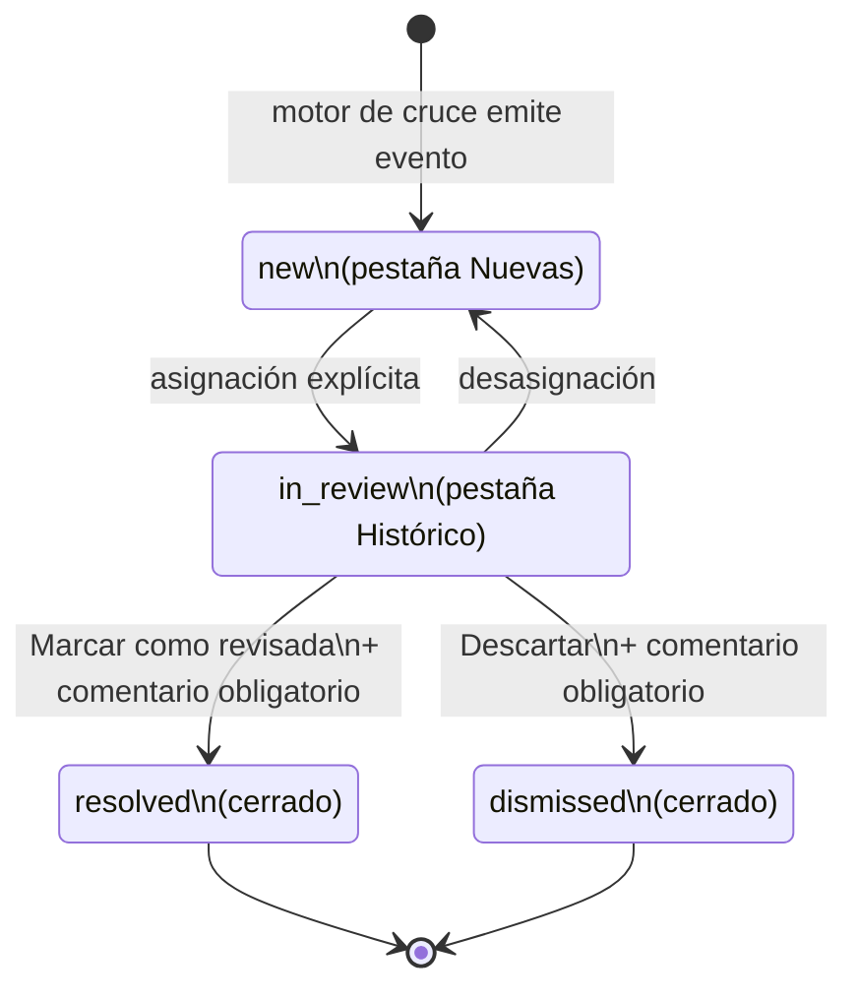
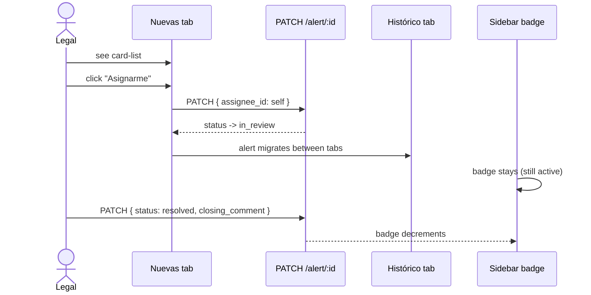

# Design — add-lex-alertas

## Context

Lex incorpora un módulo **Alertas** top-level — `/alertas` — que recibe eventos de compliance y los expone a Legal & Compliance para triage. v1 ships con un tipo de alerta:

- **`SCREENING_BLACKLIST_MATCH`** — generada cuando el motor de cruce de OPS detecta que un movimiento tiene `counterparty_tax_number` que matchea un CUIT en la Lex Blacklist (per `lex-blacklist`). El frontend de OPS no participa — el motor vive backend, y emite el evento que Lex consume.

Pero la arquitectura debe permitir nuevos tipos sin restructurar el page (DOCUMENT_DUE_DATE, LIMIT_OVERAGE, fraud-detection futuros).



```mermaid
flowchart TB
    Sidebar[Sidebar entry · Alertas\nbadge = count(new + in_review)] --> Page[/alertas/]
    Page --> Tabs[Two-tab segmenter]
    Tabs --> Nuevas[Pestaña Nuevas\nstatus = new\ncard-list TRD-style]
    Tabs --> Historico[Pestaña Histórico\nstatus in {in_review, resolved, dismissed}\ntable with filters]
    Nuevas --> Detail[Vista detalle ·\n/alertas/:id]
    Historico --> Detail
    Detail --> Match[Información del match]
    Detail --> Assign[Sección Asignación]
    Detail --> Timeline[Timeline · comentarios + transitions]
```



Acceso por rol (per `lex-roles` y `discoveries/lex-alertas-discovery.md` §5.5):
- **`ADMIN_LEX`** — full access (view, assign, comment, close).
- **`COMMERCIAL_LEX`** — view alerts of clients they are assigned to; comment but not assign or close.
- **`VIEWER_LEX`** — read-only, only for own assignations.
- **`COMPLIANCE`** (external role) — full access analogous to ADMIN_LEX.

Backend hace el filtering server-side; el frontend gates UI affordances solamente.

---

## Decision 1 — Two-tab layout (Nuevas / Histórico), card-list vs table

### The question

¿Una sola lista? ¿Tres tabs (new / in_review / closed)? ¿Dos? ¿Card-list o tabla?

### The decision

**Dos tabs:** Nuevas (status `new`, card-list) y Histórico (status `in_review`/`resolved`/`dismissed`, table). Default tab Nuevas. Per la iteración 2026-04-24 PM, el card-list es para "trabajo activo" — visualmente diferenciado para forzar prioridad — mientras que el table es para "visibility long-tail".

### Rationale

- **Card-list TRD-style** comunica urgencia visualmente.
- **Tabla en Histórico** permite escaneo masivo + filtros.
- **Default Nuevas** porque la mayoría del trabajo es triage de nuevas alertas.
- **Status `new` aislado en su tab** evita que el user lo "pierda" en la masa de Histórico.

### Tradeoff accepted

User que quiere ver TODO en una sola lista no puede. Aceptado — la separación es deliberada para forzar el flujo correcto.

---

## Decision 2 — State machine canonical: new → in_review → resolved|dismissed

### The question

¿Qué transiciones permitimos? ¿Direct close de un `new`? ¿Reopen?

### The decision

**Solo cuatro transiciones:** `new → in_review` (asignación), `in_review → new` (desasignación), `in_review → resolved` (Marcar como revisada + comentario), `in_review → dismissed` (Descartar + comentario). Direct `new → resolved/dismissed` NO disponible. Closed states terminales — no Reopen.

### Rationale

- **Forzar in_review intermedio** garantiza que cada cierre tiene un assignee responsable.
- **No reopen** preserva audit trail; un cambio de mente requiere alta nueva.
- **Comentario obligatorio en cierre** documenta el motivo.

### Tradeoff accepted

Si el user "se equivoca" cerrando, no puede reopen — tiene que dejar comentarios o esperar que se genere otra alerta. Aceptado — preferimos audit clean over flexibility.

---

## Decision 3 — Closing transitions: status + comment in one atomic PATCH

### The question

¿El cierre es `PATCH /alert/:id { status }` + `POST /alert/:id/comment { body }` (dos requests)? ¿O `PATCH /alert/:id { status, closing_comment }` (uno)?

### The decision

**Uno: `PATCH /alert/:id { status: 'resolved'|'dismissed', closing_comment: '...' }`.** Atomic.

### Rationale

- **Atomicidad del cierre.** Si el comment falla, el status no debe avanzar.
- **Backend puede validar el comment como required en el mismo handler.**
- **Less round-trips.**

### Tradeoff accepted

El backend tiene que entender este shape. Aceptado — está coordinado con el dev backend.

---

## Decision 4 — Assignment flow: PATCH atomic con state migration entre tabs

### The question

¿Asignación es separada del status? ¿Status sigue automáticamente?

### The decision

**`PATCH /alert/:id { assignee_id }`. Backend devuelve nuevo status.** Si la alerta estaba en `new` y ahora tiene assignee, el response trae `status='in_review'` y la alerta migra de Nuevas a Histórico en el mismo render cycle. Desasignación reverso.

### Rationale

- **El backend mantiene la regla de transición.** Frontend no decide.
- **Migration entre tabs es UI consequence** — la alerta no desaparece, cambia de pestaña.

### Tradeoff accepted

Si el user va a "Asignarme" y la alerta cambia de tab, puede confundir. Aceptado — toast de confirmación + the alerta misma muestra el cambio de pestaña en el sidebar tab counter.

---

## Decision 5 — Detail view: match info + assignment + combined timeline

### The question

¿Qué se muestra en `/alertas/:id`? ¿En qué orden?

### The decision

**Cuatro secciones top-down:** (1) Header con status badge + título + actions per state machine; (2) Información del match (cliente con `Ver legajo`, contraparte name+CUIT, motivo blacklist frozen at match time, movement details, sponsor, `Ver movimiento en OPS` link); (3) Asignación (responsable + assignment affordances); (4) Timeline (comments + state transitions + assignment events interleaved, descending chronological).

### Rationale

- **Header primero** comunica "qué es y qué puedo hacer".
- **Match info segundo** porque es el contenido principal.
- **Asignación visible explicit** para que se sepa quién es responsable.
- **Timeline al fondo** para context histórico.

### Tradeoff accepted

Para alertas con timeline largo, scroll al fondo es necesario. Aceptado.

---

## Decision 6 — Histórico filter set extenso

### The question

¿Cuántos filtros para Histórico? Demasiados pollute, pocos no permite triage real.

### The decision

**Seis filtros:** Tipo de alerta (multi), Estado (multi, default `in_review`, sin opción `new` que vive en Nuevas), Responsable (Todos / Yo / Sin asignar / [user list]), Cliente (autocomplete), Rango de fechas, CUIT de contraparte (debounced 300 ms). URL persists.

### Rationale

- **Estado default `in_review`** porque es el "trabajo activo" en Histórico.
- **No `new` en Estado filter** porque se va a la tab Nuevas si quieres ver eso.
- **CUIT contraparte** porque triage frecuente es por CUIT específico.

### Tradeoff accepted

Sin filtro free-text combinado. Aceptado — los filtros estructurados cubren el real workflow.

---

## Decision 7 — Comments immutable, max 2000 chars, optimistic prepend

### The question

¿Editar/borrar comments? ¿Length cap? ¿Optimistic update?

### The decision

**Inmutables, max 2000 chars con counter visible, optimistic prepend, rollback on failure.**

### Rationale

- **Inmutables** preserva audit trail.
- **2000 chars** alcanza para justificación detallada sin loose-write essay.
- **Optimistic prepend** se siente snappy.

### Tradeoff accepted

Un typo requiere otro comment. Aceptado.

---

## Decision 8 — Type-extensible registry: nuevos tipos sin tocar el page

### The question

Agregar `DOCUMENT_DUE_DATE` futuro, ¿requiere rewrite del page entero?

### The decision

**Registry pattern:** `AlertTypeRegistry` mapea `type → { label, icon, summaryRenderer, detailRenderer, columnExtras }`. Agregar tipo = nuevo entry + nuevo renderer component. Page-level layout (tabs, state machine, assignment, timeline, role gating) untouched. Filter Tipo lista every entry.

### Rationale

- **Open-closed principle.** Page closed for modification, open for extension via registry.
- **Renderers per-type** permiten UX específico (e.g. DOCUMENT_DUE_DATE muestra fecha; LIMIT_OVERAGE muestra monto sobregirado).
- **Fallback genérico** para tipos desconocidos del backend que el frontend no conoce todavía.

### Tradeoff accepted

El registry es central — si dos teams agregan tipos en paralelo, conflict. Aceptado — review process resuelve.

---

## Decision 9 — Sidebar badge: active count (new + in_review), refresh event-driven

### The question

¿El badge muestra qué? ¿Refresh polling o on-event?

### The decision

**Badge = count of `status in {new, in_review}` para el current user (server-filtered). Refresh on Topbar mount + después de cada mutación de alert hecha por este user.** No polling.

### Rationale

- **Active count incluye in_review** porque también es trabajo pendiente del user.
- **No polling** consistente con `lex-notificaciones`.

### Tradeoff accepted

Una alerta nueva creada por el motor de OPS puede tardar hasta el próximo evento de refresh para aparecer en el badge. Aceptado.

---

## Decision 10 — Permissions: ADMIN_LEX/COMPLIANCE full, COMMERCIAL_LEX comment-only, VIEWER_LEX read-only

### The question

¿Qué puede hacer cada rol con las alertas? ¿COMMERCIAL_LEX puede assign? ¿VIEWER_LEX comment?

### The decision

| Acción | ADMIN_LEX | COMPLIANCE | COMMERCIAL_LEX | VIEWER_LEX |
|---|---|---|---|---|
| View (server-filtered) | all | all | own assigned clients | own assignations |
| Assign | ✅ | ✅ | ❌ | ❌ |
| Close | ✅ | ✅ | ❌ | ❌ |
| Comment | ✅ | ✅ | ✅ | ❌ |

### Rationale

- **COMMERCIAL_LEX comment-only** porque son la primera línea — pueden anotar pero no decidir cierres.
- **VIEWER_LEX read-only** consistente con su rol en el resto.
- **`COMPLIANCE`** es un external role para no-Lex compliance staff con full access analogous to ADMIN_LEX.

### Tradeoff accepted

Un COMMERCIAL_LEX que descubre algo crítico y necesita escalar tiene que pedir a ADMIN_LEX. Aceptado — la regla de quién decide cierres es estricta por compliance.

---

## Out of scope

- **OPS-side detection engine** — backend; G-11 owner Santiago.
- **OPS → Lex event channel** technical contract — backend.
- **Email notifications** of alerts — futuro.
- **Bulk close / bulk assign** — un futuro change si workflow lo requiere.
- **Métrics dashboards** sobre alertas — futuro.
