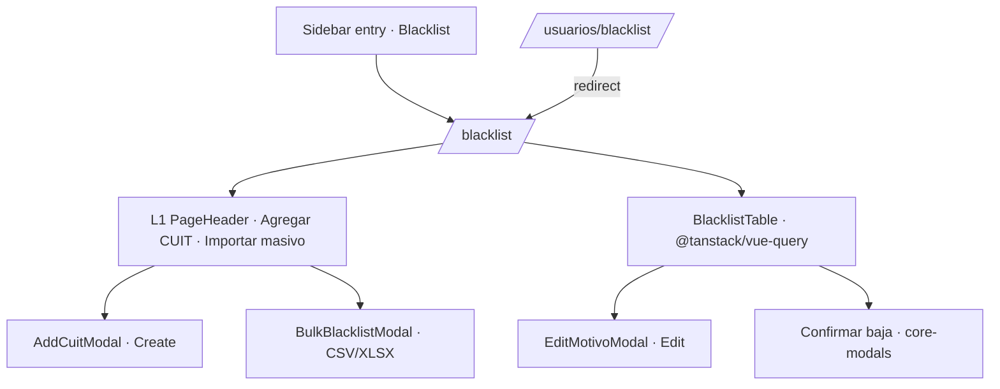
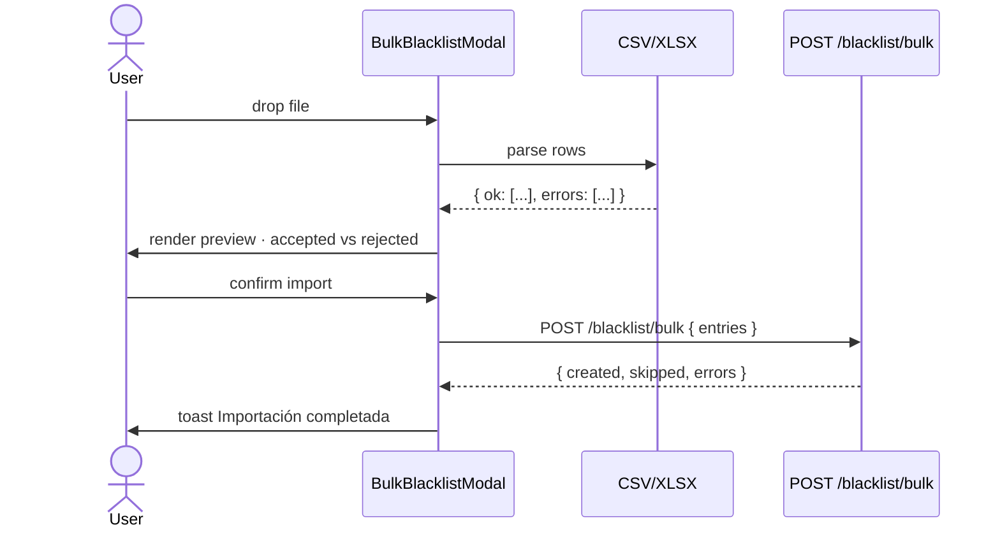

# Design — add-lex-blacklist

## Context

La Blacklist de Lex es el **registro de CUITs restringidos** — personas físicas o jurídicas que Compliance/Legal marcó como inhabilitadas para operar con el grupo Ardua. Cada entrada tiene un CUIT (11 dígitos), un motivo de texto libre, una fecha de carga y un usuario que la cargó. La página soporta cuatro flujos: ver el listado paginado/filtrable, agregar un CUIT de a uno, importar muchos CUITs desde un archivo CSV/XLSX, y eliminar entradas con confirmación destructiva.

El legacy `blacklist.vue` vive en `/usuarios/blacklist` por una decisión histórica del prototipo original: todas las páginas "de configuración" se anidaron bajo Usuarios. En la práctica, Blacklist no es una sub-section de Usuarios — son dominios distintos (operadores Lex vs CUITs prohibidos) y nestearlos confunde al usuario que busca la pantalla. La discovery REQ-47 (`discoveries/lex-discovery.md` §8.2) explícitamente eleva Blacklist a top-level.

La importación masiva es el flujo no trivial. El legacy parsea el archivo en el server, lo cual significa: el usuario sube un archivo de 200 filas, espera, y recibe un mensaje de error si una fila tiene un CUIT inválido. El nuevo design parsea el archivo en el browser primero, muestra un preview con filas aceptables vs rechazadas, y el usuario decide submit con la subset válida.

---

## Decision 1 — Top-level Sidebar entry, legacy URL redirects

### The question

¿Dónde vive Blacklist en la nav? Opciones: (a) seguir nested bajo Usuarios; (b) elevar a top-level; (c) sub-section de un nuevo grupo "Configuración" o "Compliance".

### The decision

**Top-level Sidebar entry** al mismo nivel que Clientes, Altas, Usuarios. La ruta canónica es `/blacklist`. El legacy `/usuarios/blacklist` queda registrado en el router como redirect a `/blacklist` para no romper bookmarks.

### Rationale

- **Blacklist es un dominio independiente.** No es configuración de Usuarios; es un registro propio.
- **Frecuencia de uso justifica el slot.** Compliance entra a Blacklist con frecuencia (cargas masivas tras alertas regulatorias); meter un click extra en Usuarios añade fricción.
- **Discovery REQ-47 ya lo decidió** y el equipo de producto lo respaldó.

### Tradeoff accepted

Una hipotética agrupación futura "Compliance" (que reuniría Blacklist, Auditoría, Reportes regulatorios) requiere mover Blacklist nuevamente. Aceptado — esa agrupación todavía no existe y reorganizar la nav es un OpenSpec change, no un riesgo.

---

## Decision 2 — Browser-side CSV/XLSX parsing with per-row preview before submission

### The question

¿Dónde se valida la importación masiva? Opciones: (a) server-side only (legacy actual); (b) client-side preview + server-side double-check; (c) sólo client-side.

### The decision

**Opción (b): preview client-side antes de submit, server-side definitivo.** El browser parsea el archivo (CSV con `papaparse`, XLSX con `xlsx` 0.18.5), valida cada fila contra el schema (`tax_number` 11 dígitos, `motivo` ≤ 500 chars), y muestra dos columnas: aceptables y rechazadas con razón inline. El submit envía sólo las aceptables a `POST /blacklist/bulk`. El server vuelve a validar (defense in depth) y responde con `{ created, skipped (duplicates), errors }`.

### Rationale

- **Feedback inmediato.** Una fila con CUIT de 9 dígitos se ve antes de enviar; el usuario corrige el archivo y vuelve a intentar sin round-trip al server.
- **Skipped vs errors.** El server distingue duplicados (`skipped`) de errores reales (`errors`); el modal muestra ambos contadores tras el response.
- **Server sigue siendo autoritativo.** Frontend no decide qué se acepta; sólo filtra el ruido obvio.

### Tradeoff accepted

Para archivos grandes (~50 MB+) parsear en el browser puede congelar el thread principal por unos segundos. Aceptado — Blacklist típicamente se carga en lotes de docenas a cientos de filas, no decenas de miles. Si el negocio crece, pasamos a Web Worker en otro change.

---

## Decision 3 — CUIT immutable post-create; only Motivo is editable

### The question

¿Se puede editar un CUIT después de creado? El legacy lo permite en teoría — la edición está oculta y nadie la documentó.

### The decision

**No, el CUIT es inmutable post-create.** Sólo `motivo` se puede editar después de crear la entrada. El edit modal renderiza el CUIT como read-only (disabled input visible) y deja editable sólo el Motivo.

### Rationale

- **Cambiar un CUIT es funcionalmente crear otro.** Si Compliance descubre que cargó el CUIT equivocado, el flujo correcto es: eliminar el incorrecto + agregar el correcto. Eso preserva la auditoría.
- **Audit trail.** `created_by`, `created_at` quedan inmutables y referenciables.
- **Reduce vectores de error.** Editar el CUIT por error de tipeo y sobrescribir uno legítimo sería un incidente de compliance.

### Tradeoff accepted

Un CUIT con un dígito tipeado mal requiere dos clicks (delete + create) en lugar de uno (edit). Aceptado — la rectitud del audit trail vale el extra click.

---

## Decision 4 — Destructive confirmation always, with the CUIT quoted in the dialog body

### The question

¿Cómo se elimina una entrada? ¿Confirmación inline? ¿Modal? ¿Toast con undo?

### The decision

**Modal de confirmación destructiva per `core-modals`** con: header danger-accent, el CUIT que se elimina visible literalmente en el body, action label `Eliminar` (verb-specific, no `OK`), botón ghost `Cancelar` a la izquierda, danger-variant `Eliminar` a la derecha. Tras éxito, toast `CUIT eliminado de la blacklist`.

### Rationale

- **El CUIT en el body previene mistakes.** El usuario lee `20-12345678-9` y confirma deliberadamente.
- **Verb-specific label > genérico `OK`.** "Eliminar" comunica la acción inequívocamente.
- **No undo toast** — el delete es server-side y ya no hay forma de revertir sin un audit trail extra.

### Tradeoff accepted

El delete es 2-step (open menu → click eliminar → confirm). Aceptado — la consequencia de un delete accidental es alta (hay que recordar el CUIT y volver a cargarlo).

---

## Decision 5 — Role gating per the lex-roles matrix

### The question

¿Quién ve qué? `VIEWER_LEX` lee, `COMMERCIAL_LEX` quizás también, `ADMIN_LEX` puede mutar. ¿Qué exactamente?

### The decision

Per la matriz en `lex-roles`:

- **Read** (la página entera, tabla, filtros): VIEWER_LEX, COMMERCIAL_LEX, ADMIN_LEX.
- **Agregar CUIT**, **Importar masivo**, **Eliminar**: ADMIN_LEX only.
- **Edit Motivo**: ADMIN_LEX only (consistencia con el resto).

### Rationale

- **Compliance roles editan; commercial sólo audita.** Un comercial necesita saber si un CUIT está en blacklist (para no procesar onboarding) pero no debe modificar el registro.
- **VIEWER_LEX ve todo, muta nada** — la regla universal Lex.

### Tradeoff accepted

Si COMMERCIAL_LEX descubre un CUIT que falta en blacklist, no puede agregarlo — tiene que escalar a un ADMIN_LEX. Aceptado, es la regla del legajo Lex.

---

## Out of scope

- **Cross-checking automatizado de la blacklist contra movimientos** — eso vive en `lex-alertas`. Esta capability sólo administra el registro.
- **Sync con un proveedor externo de blacklists regulatorias** (BCRA, OFAC) — futuro change.
- **Soft delete con history.** El delete actual es hard; agregar history requiere un change separado.
- **Archivado / unblacklist con razón.** Hoy un CUIT erróneamente blacklisteado se elimina; un flag `archived: true` con motivo de unblacklist es deseable pero no v1.
