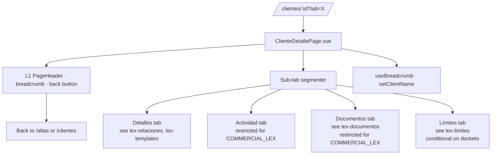
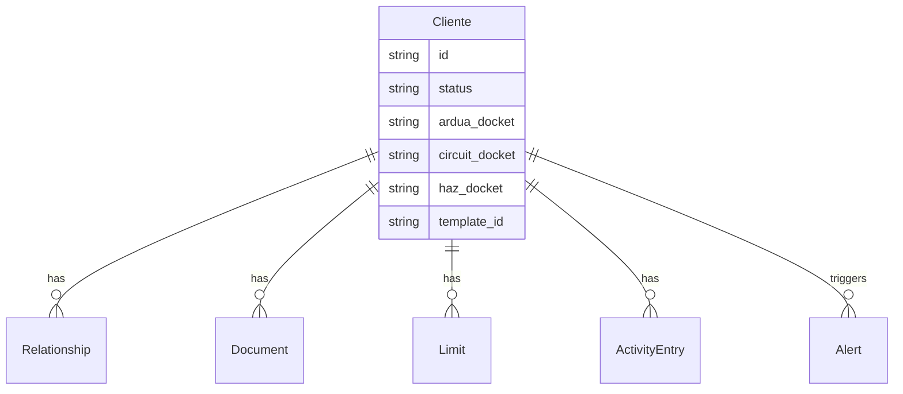

# Design — add-lex-cliente-detalle

## Context

`/clientes/:id` es el **legajo unificado** de un Cliente Lex — la pantalla a la que cae el operador para ver y modificar todo lo relacionado a un Cliente específico. Cuatro pestañas:

- **Detalles** (default) — identidad, dockets, onboarding, relaciones, similarity warnings (solo si PENDING_REVIEW)
- **Actividad** — timeline de comments + system logs (restringida para `COMMERCIAL_LEX`)
- **Documentos** — vault S3 (restringida para `COMMERCIAL_LEX`)
- **Límites** — limits per-entidad (visible solo si Cliente tiene al menos un docket Circuit o Haz)

Esta spec gobierna el shell — el page-level container, el tab routing, el back-button smart, el breadcrumb, el 404. **El contenido** de cada tab vive en su capability propia: `lex-relaciones` (pickers de Detalles), `lex-documentos` (Documentos tab), `lex-limites` (Límites tab). Actividad timeline (history + comments) la integra esta page directamente en v1 — su own capability puede vivir en futuro.

---

## Decision 1 — Cuatro tabs, Límites condicional por docket presence

### The question

¿Las cuatro tabs siempre? ¿Se ocultan basado en algún estado del Cliente?

### The decision

**Cuatro tabs siempre, excepto Límites que depende de `circuit_docket || haz_docket`.** Si Cliente sin docket, la tab Límites no se renderiza y deep-link a `?tab=limites` cae silently a `?tab=detalles`.

### Rationale

- **Un Cliente sin docket no tiene operatoria** — no hay limits para asignar.
- **Otras tabs siempre presentes** porque siempre tienen contenido relevante (incluso un Cliente recién creado tiene Identidad).
- **Silent fallback** evita un 404 confuso para deep-links viejos.

### Tradeoff accepted

Si Compliance asigna un docket después, el user tiene que navegar de nuevo para ver la tab Límites. Aceptado — el cambio es raro.

---

## Decision 2 — `?tab=` persistence con replace history (no push)

### The question

¿Cambiar de tab debe quedar en el history del browser? ¿Click → Back vuelve a la tab anterior o sale del page?

### The decision

**`replace` no `push`.** Cambiar de tab actualiza el query param sin agregar entry a history. Browser Back desde `?tab=actividad` sale a `/clientes`, no vuelve a `?tab=detalles`.

### Rationale

- **Browser back significa "salir del Cliente"**, no "tab anterior". Las tabs son sub-navegación, no navegación principal.
- **Previene 5+ entries de history** por sesión de uso típica.

### Tradeoff accepted

Un user que quiere "volver a la tab Detalles" tiene que clickear la tab, no usar Back. Aceptado — el comportamiento estándar de SPAs con tabs.

---

## Decision 3 — COMMERCIAL_LEX gated en Actividad y Documentos: placeholder + no fetch

### The question

¿COMMERCIAL_LEX ve la tab Actividad/Documentos vacía? ¿No la ve? ¿La ve pero gris? ¿Se hace fetch igual?

### The decision

**Tab visible (trigger), body con placeholder "Acceso restringido", no fetch fired.** El user sabe que la tab existe pero no la puede acceder. Servidor no se carga inútilmente.

### Rationale

- **Trigger visible** comunica que el sistema tiene esa info — solo no es accesible para este rol. Si la oculto, el user no sabe que existe.
- **No fetch** evita waste y ataque vector — un COMMERCIAL_LEX que tira un fetch directo recibe 403 del backend de todos modos, pero el frontend no debe pretender hacerlo.

### Tradeoff accepted

Un COMMERCIAL_LEX click frecuente en una tab restringida ve el placeholder cada vez. Aceptado — claridad > silencio.

---

## Decision 4 — Back-button derivado del status del Cliente, sin sessionStorage marker

### The question

¿Cómo sabe el detail dónde volver? El draft anterior usaba un marker en `sessionStorage.lex.clientDetailSource` escrito por `lex-clientes` y `lex-altas` para distinguir entre las dos pages legacy. Con la unificación de `/altas` en `/clientes` (per `lex-clientes` Decision 1), ese mecanismo es innecesario — sólo hay una page de origen.

### The decision

**Back-button siempre apunta a `/clientes?segment=<X>`, donde `<X>` se deriva del `status` del Cliente cargado** (`PENDING_REVIEW → pendientes`, `APPROVED → activos`, `DEACTIVATED → deactivados`). Si el GET aún está en flight (deep-link directo), fallback a `/clientes` sin segmento (defaultea a `Activos` per `lex-clientes`). No se lee ni escribe `sessionStorage`.

### Rationale

- **El status del Cliente cargado YA contiene la información que el marker buscaba.** No hay que recordar de dónde vino el user — el Cliente mismo lo dice.
- **Resilientes a deep-links** (notificaciones, links externos, refresh): el back funciona aunque nunca hayas pasado por `/clientes` antes.
- **Una pieza menos para mantener.** No hay key transient que se pueda leakear entre tabs o sesiones.
- **Consistente con la unificación `/altas` ↔ `/clientes`** — ya no hay dos orígenes posibles.

### Tradeoff accepted

Si el user llegó al detail desde `/usuarios` (futuro deep-link) o desde `/alertas`, el back-button lo manda a `/clientes?segment=...` en lugar de a la page de origen. Aceptado — un click extra para volver a la otra page es preferible a re-introducir el marker pattern. Si el negocio empieza a tener muchos cross-links a `/clientes/:id`, evaluamos un breadcrumb-stack composable como nueva decision en otro change.

---

## Decision 5 — Breadcrumb via useBreadcrumb() con cleanup

### The question

¿Cómo se renderiza `Clientes › Acme Corp` en el Topbar? ¿Hardcoded? ¿Composable global?

### The decision

**Composable `useBreadcrumb()`** con `setClientName(name)` cuando el GET responde y `clearClientName()` en `onBeforeUnmount`. Pre-load: `Clientes › Cargando…`. Cleanup garantiza que la próxima page no herede stale.

### Rationale

- **Composable** porque varias pages lo necesitan (futuro: contratos, alertas).
- **Cleanup explícito** previene bugs de "el breadcrumb sigue diciendo Acme Corp en /clientes".
- **Loading state** explícito vs suprimir el breadcrumb (que se vería como flicker).

### Tradeoff accepted

El composable mantiene state global que requiere disciplina de cleanup. Aceptado — el costo es minor.

---

## Decision 6 — 404 limpio sin auto-redirect

### The question

¿Si el ID no existe? ¿Auto-redirect a `/clientes`? ¿Toast + redirect? ¿Page con EmptyState?

### The decision

**Page con `EmptyState` y CTA `Volver a Clientes`. No auto-redirect.**

### Rationale

- **Auto-redirect oculta el problema** — el user no sabe qué pasó.
- **EmptyState explica** y le da un camino deliberado.
- **CTA** es 1-click, ergonómico.

### Tradeoff accepted

Un user que pega un ID viejo se queda en una page vacía hasta que clickea. Aceptado — es claro.

---

## Decision 7 — Detalles section order canonical

### The question

¿En qué orden van Identidad, Dockets, Onboarding, Relaciones, Similarity warnings?

### The decision

**Top-down:** Identidad → Dockets → Onboarding → Relaciones → Advertencias de similitud (solo PENDING_REVIEW).

### Rationale

- **Identidad primero** — name + CUIT son los identificadores; el user los necesita primero para confirmar que está en el Cliente correcto.
- **Dockets segundo** — qué entidades del grupo opera con el Cliente.
- **Onboarding** — cómo se onboardó (template + AIPrise).
- **Relaciones** — la red.
- **Similarity warnings al fondo** — alertas relevantes solo en PENDING_REVIEW; al fondo porque son acción-oriented (revisar duplicados antes de aprobar).

### Tradeoff accepted

Para Clientes con muchas relaciones, scroll para llegar a similarity warnings. Aceptado — orden lógico > ergonomía marginal.

---

## Out of scope

- **Tab content of Actividad / Documentos / Límites** — `lex-documentos`, `lex-limites`, y un futuro `lex-actividad`.
- **Edit del Cliente entire** (cambiar `name`, `tax_number`, etc.) — flujos sub-section dentro de Detalles, governed by `lex-relaciones` para relationships y futuros changes para identity edits.
- **Compare con histórico del Cliente** — futuro change si el negocio lo requiere.
- **Bulk actions** desde el detail — no hay bulk a nivel un solo Cliente.
