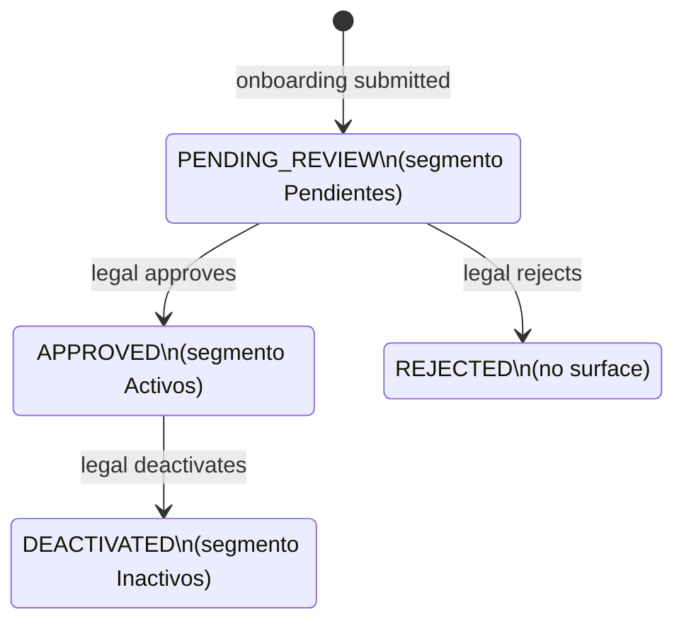

# Design — add-lex-clientes

## Context

`/clientes` es el **dashboard operativo principal** de Lex — la lista paginada de Clientes que Legal & Compliance + Comercial usan todos los días. El legacy `clientes.vue` es el archivo más grande de `core-lex-frontend` (~1,419 LOC) y empaqueta dos pestañas no relacionadas en un mismo file (Clientes population + CVUs accounts). En paralelo, el legacy `altas.vue` (~1,036 LOC) implementa un **listing separado** filtrado por `status='PENDING_REVIEW'` con su propia tabla, sus propios filtros, sus propias acciones — todo paralelo a `/clientes`.

```mermaid
flowchart TB
    Page[ClientesPage.vue] --> L1[L1 PageHeader]
    L1 --> Segmenter[Segmenter · Pendientes / Activos / Inactivos]
    L1 --> CrearEmpresa[Crear Empresa CTA]
    Page --> SubTabs[Sub-tab segmenter Clientes / Cuentas]
    SubTabs --> ClientesTab[Clientes tab\nthis spec]
    SubTabs --> CuentasTab[Cuentas tab\nlex-cuentas-cvu]
    ClientesTab --> L3Filters[L3 FilterBar · debounced inputs]
    ClientesTab --> Table[ClientesTable · @tanstack/vue-query]
    Table --> Row[ClienteRow · highlight if assigned]
    Row --> Detalle[/clientes/:id]
    Row --> AssignPopover[SelectUserPopover]
    Row --> ActionsMenu[Eliminar · destructive confirm]
    L3Filters --> Query[useQuery · key=['lex','clients',{ segment, ...filters }]]
    Query --> API[GET /client?status=...]
    CrearEmpresa --> CreateModal[CreateBusinessModal\nvee-validate + zod\nsimilarity warnings]
```



El status del Cliente determina en qué segmento aparece. El segmenter es la primera decisión que toma el operador al entrar; los demás filtros (Nombre, CUIT, Docket, Partner, Plantilla, Tipo cliente, Tipo) son sub-filtros dentro del segmento activo. `REJECTED` no aparece en ninguna superficie de Lex.

---

## Decision 1 — Altas y Clientes son el mismo registro con segmentación, no dos pages

### The question

El legacy ships `/altas` (status=`PENDING_REVIEW`) y `/clientes` (status in `{APPROVED, DEACTIVATED}`) como dos pages independientes con dos tablas distintas. Cada una reimplementa column set, filtros, paginación, asignación, eliminación. Conceptualmente son **el mismo Cliente en distinto status**. ¿Mantenemos las dos pages o unificamos?

### The decision

**Una sola page `/clientes` con `<Segmenter>` Pendientes / Activos / Inactivos.** El segmenter mapea 1:1 a `Cliente.status`:

- `Pendientes` → `status='PENDING_REVIEW'` (era `/altas`)
- `Activos` → `status='APPROVED'`
- `Inactivos` → `status='DEACTIVATED'`

`REJECTED` no se surface en ninguna pestaña — ese status pertenece a auditoría, no a operatoria. Toda la operatoria del legacy `/altas` (queue PENDING_REVIEW, Crear Empresa, similarity warnings, Asignar, Eliminar) se mueve al segmento Pendientes. La legacy URL `/altas` queda registrada como redirect a `/clientes?segment=pendientes` para no romper bookmarks. La capability `lex-altas` deja de existir como entidad separada — sus Requirements se absorben acá.

### Rationale

- **Reuso real.** Una sola tabla, un solo SelectUserPopover, un solo `useQuery` con la misma cache key strategy. Cualquier fix se aplica una vez.
- **Mental model alineado con el dominio.** Un Cliente, un legajo, varios estados — eso es lo que Lex es. La separación en dos pages era una decisión de implementación, no de dominio.
- **Server-side filtering trivial.** El segmento se traduce a `?status=` en la query. El backend ya lo soportaba.
- **El detail page se simplifica.** Su smart back-button (que necesitaba `sessionStorage.lex.clientDetailSource` para distinguir si volver a `/altas` o `/clientes`) se vuelve trivial: vuelve siempre a `/clientes` (con el segmento que correspondía al status).

### Tradeoff accepted

- **Compliance que tenía bookmarkeado `/altas` siente el cambio.** Mitigado por el redirect — el bookmark sigue funcionando, sólo cambia la URL final.
- **Operadores acostumbrados a "trabajar en `/altas` durante una hora" pasan a "trabajar en `/clientes?segment=pendientes`".** Cambio mental, no funcional. El segmenter es prominente en el L1 header — no se pierde.
- **Notificaciones de tipo `CLIENT_ASSIGNMENT` que linkeaban a `/altas/:id` para Clientes en PENDING_REVIEW ahora linkean a `/clientes/:id?tab=detalles`.** El detail page maneja PENDING_REVIEW igual que cualquier otro status (similarity warnings se renderizan condicionalmente cuando `status='PENDING_REVIEW'`, per `lex-cliente-detalle`).
- **Cualquier app derivada del template Lex (futura) hereda este modelo unificado, no la separación.** Aceptado — es lo que queremos.

---

## Decision 2 — Default segment es Activos, persistido en URL via `?segment=`

### The question

¿Qué segmento es el default al entrar a `/clientes`? ¿Persiste en URL para deep-linking? ¿Persiste por user en localStorage?

### The decision

**Default `Activos`.** El segmento activo se serializa en la URL como `?segment=pendientes|activos|inactivos`. Una visita sin parámetro abre `Activos`. El segmento NO se persiste en `localStorage` — un usuario que abre `/clientes` desde una notificación / bookmark / nueva pestaña obtiene el comportamiento default predecible.

### Rationale

- **`Activos` es el caso más frecuente.** El day-to-day del comercial y de Compliance pasa en Activos.
- **`Pendientes` es triage** — los Compliance que hacen triage van explícitamente al segmento Pendientes; un click en el segmenter es ergonómico.
- **`Inactivos` es archivo** — visitado raramente.
- **No localStorage** evita el caso confuso de "abro la app y no entiendo por qué estoy en un segmento raro" (porque la última vez que cerré estaba ahí).
- **URL persistence permite deep-linking** — un Compliance puede mandar un link "ver el legajo de Acme" con `/clientes?segment=pendientes&name=Acme`.

### Tradeoff accepted

Compliance que pasa el 80% del día en Pendientes tiene que clickear una vez al entrar. Aceptado — un click es barato y la previsibilidad universal vale más que el atajo personalizado.

---

## Decision 3 — Estado column ausente; Tipo cliente filter desambigua donde haga falta

### The question

La columna `Estado` del legacy mostraba `APPROVED` / `DEACTIVATED` / `PENDING_REVIEW`. Con el segmento como driver, todos los registros del segmento activo tienen el mismo `Estado`. ¿Mantenemos la columna?

### The decision

**No, la columna `Estado` se omite por completo.** El segmento ya comunica el estado — repetirlo en cada fila es ruido visual. Los demás filtros (Nombre, CUIT, Docket, Partner, Plantilla, Tipo cliente, Tipo) sí se mantienen — son ortogonales al status.

### Rationale

- **Densidad informativa.** Sacar la columna libera ~80px que pueden ir a Nombre o a Acciones.
- **Sin redundancia.** El user no necesita confirmar que el registro `APPROVED` que ve está en `Activos`.
- **Si el negocio quiere "Estado" detallado para auditoría** (e.g. para distinguir sub-status dentro de Activos), eso es un nuevo Requirement con su propia columna especializada — no recuperar la columna canónica.

### Tradeoff accepted

Operador que copia un row para reportar a un compañero pierde la columna explícita "este es PENDIENTE". Mitigado: el contexto del segmenter en el L1 es visible en cualquier captura de pantalla.

---

## Decision 4 — Crear Empresa CTA siempre visible, gateado por rol — el cliente nace en Pendientes

### The question

¿El CTA `Crear Empresa` aparece sólo cuando `Pendientes` está activo, o siempre? ¿Quién lo puede usar?

### The decision

**Siempre visible en el L1 header (gateado por `core-layout` Requirement "≤3 CTAs"), oculto para `VIEWER_LEX`.** Click → `CreateBusinessModal`; el Cliente creado nace con `status='PENDING_REVIEW'` y aparece en el segmento Pendientes inmediatamente (server-side query refetcha si el user está en Pendientes; cache se invalida sino).

### Rationale

- **Crear es siempre legítimo.** Cualquier rol comercial / admin puede crear una empresa en cualquier momento — no hay un "modo creación" que requiera estar en un segmento.
- **El destino es siempre Pendientes** — toda creación manual entra en triage de Compliance, sin excepción.
- **Hidden para VIEWER_LEX** consistente con la matriz de `lex-roles`.

### Tradeoff accepted

Un comercial que crea una empresa estando en `Activos` no ve el resultado en su tabla actual. El toast `Empresa creada` aclara dónde queda; el segmenter ofrece el camino a Pendientes. Aceptado — la alternativa (re-segmentar automáticamente al crear) sería intrusiva.

---

## Decision 5 — Similarity warnings inline antes del submit; label switch a `Crear de todos modos`

### The question

Cuando el user tipea un `tax_number`, el backend puede detectar matches similares (CUITs parecidos, nombres parecidos). ¿Bloqueamos? ¿Avisamos? ¿No avisamos?

### The decision

**Avisamos sin bloquear.** Debounced 300 ms `GET /client?tax_number_or_similar=...`. Si hay matches, render inline beneath the field con name, dockets, score, y link `Ver legajo existente` (new tab). El submit no se bloquea — pero el label cambia de `Crear Empresa` a `Crear de todos modos` mientras hay warnings activas. Eso fuerza un click consciente.

### Rationale

- **Evitar duplicados es alta prioridad.** Un legajo duplicado complica auditoría y reportes.
- **Pero no podemos bloquear** — pueden existir cases legítimos con CUITs muy similares (e.g. fideicomiso vs empresa misma razón social).
- **El label switch fuerza intención.** "Crear de todos modos" es deliberada confirmación.

### Tradeoff accepted

Una empresa que cumple format check y no tiene similarity matches es un click `Crear Empresa` normal. Si después aparece un match retrasado, ya creamos. Aceptado — el debounce 300ms y el rate de creación lo hacen poco frecuente.

---

## Decision 6 — Per-row Asignar via SelectUserPopover con optimistic update; visible per segment

### The question

¿En qué segmentos aplica la asignación? ¿Sólo Pendientes (donde Compliance triagea)? ¿En todos?

### The decision

**Asignar visible en `Pendientes` y `Activos`, oculto en `Inactivos` (no tiene sentido asignar un Cliente desactivado).** Inline popover (`SelectUserPopover`), optimistic update + `PATCH /client/:id { assigned_user_id }`. Failure → rollback + toast `No se pudo asignar` con `Reintentar`. Trigger hidden para VIEWER_LEX (sólo lee texto plano del usuario asignado).

### Rationale

- **Pendientes:** Compliance asigna a un comercial mientras triagea.
- **Activos:** Reasignar Clientes entre comerciales es un workflow real (rotación, cobertura).
- **Inactivos:** no hay operatoria — no se asigna.
- **Optimistic** porque la asignación se siente instantánea.

### Tradeoff accepted

Un VIEWER_LEX en Inactivos no ve assignment status en absoluto (no popover, no texto). Mitigado: el contexto Inactivos hace que la asignación sea irrelevante.

---

## Decision 7 — Eliminar destructive confirmation, ADMIN_LEX only, segment-aware

### The question

¿Quién puede eliminar Clientes? ¿En qué segmentos? ¿Hay archive/soft-delete?

### The decision

**ADMIN_LEX only**, hard delete (`DELETE /client/:id`), confirmación destructiva per `core-modals`. Disponible en `Pendientes` (eliminar un alta errónea) y `Inactivos` (limpieza de archivo); **oculto en `Activos`** — un Cliente activo no se elimina, se desactiva primero (futuro Requirement: action `Desactivar` en Activos que mueve a Inactivos).

### Rationale

- **`COMMERCIAL_LEX` no elimina** — un comercial podría borrar un legajo legítimo por error.
- **Hard delete** porque PENDING_REVIEW que no debían crearse no agregan valor archivado, y los Inactivos eliminados son explícitamente para limpieza.
- **No Eliminar en Activos** previene la destrucción accidental de un Cliente vigente.

### Tradeoff accepted

Hard delete es irreversible. Mitigado: el confirmation modal con nombre del Cliente.

---

## Decision 8 — Filter state via URL, page-size persistencia compartida

### The question

¿Filtros y page-size se preservan al cambiar de segmento? ¿Cómo se persisten?

### The decision

**Filtros persisten en URL** — al cambiar de segmento, los demás filtros (Nombre, CUIT, etc.) se mantienen activos si siguen siendo aplicables. Page size se persiste en `localStorage.lex.clientes.pageSize`, compartido entre segmentos.

### Rationale

- **URL state** preserva contexto a través de navegaciones (entre `/clientes` y `/clientes/:id` y back).
- **Compartir page size** entre segmentos refleja la preferencia del user (un user que prefiere `100` por página lo prefiere en cualquier segmento).

### Tradeoff accepted

Si un user tiene un filtro `template_id=ardua-kyb` activo en `Activos` y cambia a `Pendientes`, el filtro persiste; si no hay matches, ve EmptyState. Aceptado — preferible a "perder filtros al navegar".

---

## Out of scope

- **Cuentas / CVUs tab** — vive en `lex-cuentas-cvu`.
- **Bulk actions** sobre Clientes (deactivate masivo, reassign masivo, transition de status en lote) — futuro change.
- **Export XLSX** de Clientes — el legacy lo tiene en CVUs only; sin demanda en Clientes hoy.
- **Sort multi-column** — single column sort hoy alcanza.
- **Action `Desactivar` en Activos** (que movería a Inactivos sin eliminación) — futuro change cuando el negocio lo defina.
- **Server-side filter logic** — backend.
- **Default segment per-rol** (ej. ADMIN_LEX → Pendientes, COMMERCIAL_LEX → Activos) — descartado en v1; default universal `Activos`.
