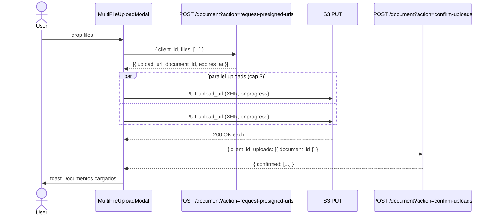
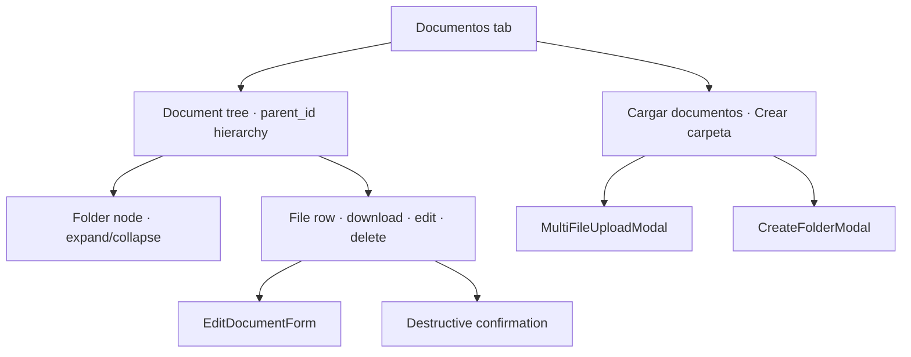

# Design — add-lex-documentos

## Context

La tab **Documentos** en `/clientes/:id` es el vault del legajo: PDFs de identidad, comprobantes de domicilio, cartas comerciales, organigramas societarios — la evidencia documental que respalda el legajo legal. El legacy implementa el flujo de upload en tres pasos contra S3 con presigned URLs:

1. **Request presigned URLs** — `POST /document?action=request-presigned-urls` con `{ client_id, files: [{ name, size, mime_type, parent_id }] }`. El backend devuelve por archivo un `{ document_id, upload_url, expires_at }`.
2. **Parallel S3 PUT** — el browser sube el archivo directo a S3 con un XHR raw, sin pasar por el backend. Esto descarga la red de Ardua y permite tracking de progreso real.
3. **Confirm uploads** — `POST /document?action=confirm-uploads` con `{ client_id, uploads: [{ document_id }] }`. El backend marca cada documento como confirmado y los expone en el listing.

El bug clásico del legacy: el S3 PUT iba por la axios instance compartida, que inyectaba el header `Authorization: Bearer <token>`. S3 rechazaba ese header (no es uno suyo) con 403 — el modal silenciaba y retry-eaba con la misma URL hasta que expiraba. El nuevo design elimina la posibilidad: el step 2 usa XHR raw, sin axios, y la spec lo locks explícitamente.

---

## Decision 1 — Three steps, S3 PUT bypasses axios

### The question

¿El step 2 (S3 PUT) va por la axios instance compartida, o por XHR raw? ¿Por qué importaría?

### The decision

**XHR raw, no axios.** El spec lo dice explícitamente: la request al S3 URL no pasa por la instancia con `setAccessTokenGetter` y NO carga `Authorization`. La motivación: S3 firma sus presigned URLs y rechaza headers extra; agregar el bearer token rompe el upload con 403.

### Rationale

- **Bug histórico evitado.** El legacy lo aprendió a la mala.
- **Progress events nativos.** XHR `progress` event es la única API que da byte-by-byte para uploads (fetch streams aún no es universal).
- **Separación de concerns.** El backend de Lex usa axios; S3 es otra cosa.

### Tradeoff accepted

XHR es más viejo que `fetch` y tiene API más verbose. Aceptado — los progress events compensan, y es código aislado en una utility.

---

## Decision 2 — Concurrency cap of 3 parallel uploads, per-file controls

### The question

¿Subimos todos los archivos de una? ¿Uno por uno? ¿Concurrencia limitada?

### The decision

**Cap 3 parallel.** El usuario puede arrastrar 10 archivos; el modal sube 3 a la vez y los demás quedan en cola. Cada fila tiene cancel y retry individuales. Cerrar el modal mientras hay uploads en curso pide confirmación destructiva.

### Rationale

- **3 es buen balance** — saturar la red local degrada otros flujos del usuario.
- **Per-file cancel/retry** porque la falla de uno no debe forzar reupload de todos.
- **Confirm on close** previene pérdida accidental.

### Tradeoff accepted

Para 50+ archivos, cap 3 hace que el upload total tarde. Aceptado — Lex no es un drive bulk; documentos del legajo se cargan en lotes pequeños.

---

## Decision 3 — Folder tree based on `parent_id`, expansion state non-persisted

### The question

¿El árbol de carpetas se persiste expandido entre reloads? ¿Cómo se navega?

### The decision

**Persiste durante la mounted lifetime, no entre reloads.** Cada folder tiene contador `(N)`. Expandir/colapsar es state local del page mount; F5 vuelve todo colapsado.

### Rationale

- **No pollute localStorage** con state efímero.
- **Reset en F5 es esperado.** Folder profundo expandido entre reloads sería intrusivo si el usuario quería empezar desde root.
- **Contador `(N)` permite scanning** sin expandir.

### Tradeoff accepted

Un usuario que vuelve a una carpeta específica frecuentemente tiene que expandirla cada vez. Aceptado — aceptable y esperado.

---

## Decision 4 — Metadata edit transitions Detail → Edit; content is read-only

### The question

¿Editar metadata abre Edit directo? ¿Pasa por Detail primero? ¿Y el contenido del archivo se puede editar?

### The decision

**Detail → Edit transition** per `core-modals`. Click `Editar` abre el Detail modal con metadata read-only; click `Editar` adentro de Detail transiciona al form. **Contenido del archivo no se puede editar** — para reemplazar, eliminar y subir nuevo. El form valida con vee-validate + zod, cap 500 chars en `description`.

### Rationale

- **Detail → Edit es el patrón canónico** del template.
- **Content immutability** simplifica audit; cualquier "edición" de contenido es un nuevo documento con su propio audit.

### Tradeoff accepted

Reemplazar un documento es 2-step (delete + upload). Aceptado — coincide con la realidad de cómo S3 + audit funcionan.

---

## Decision 5 — Fresh presigned URL per download click

### The question

¿Cacheamos la URL de descarga? Las presigned URLs expiran.

### The decision

**Fresh URL cada click.** `Descargar` siempre dispara `GET /document/:id?action=request-download-url`, después un anchor con `download` attribute para preservar filename.

### Rationale

- **Las URLs expiran** — cachear lleva a 403 después de N minutos.
- **Anchor con `download`** preserva el nombre original (filename del usuario, no el `document_id`).

### Tradeoff accepted

Doble click rápido al mismo botón hace dos requests. Aceptado — el costo es un GET extra, irrelevante.

---

## Decision 6 — Destructive delete + folder-not-empty handling

### The question

¿Cómo se elimina un documento o carpeta? ¿Carpetas con contenido?

### The decision

**Destructive confirmation** per `core-modals` con el `name` del documento en el body, action `Eliminar`. `DELETE /document/:id`. Folders no vacías → backend rejects con 409 + code `folder_not_empty`; el modal cierra y aparece toast `La carpeta no está vacía`. Eliminar hidden para VIEWER_LEX.

### Rationale

- **Confirm con name** previene mistakes.
- **Folder protection** evita pérdida cascada accidental.
- **VIEWER_LEX no muta** consistente con el resto.

### Tradeoff accepted

Para vaciar una carpeta hay que ir documento por documento o agregar bulk delete (futuro). Aceptado — la deletion cascada accidental es peor que la fricción.

---

## Out of scope

- **Server-side virus scanning** — backend; el frontend asume que confirm-uploads sólo retorna documentos limpios.
- **Document retention policies** — backend.
- **OCR / búsqueda full-text** — futuro.
- **Bulk download (zip)** — futuro; el legacy tiene `jszip` but el flow no está formalizado.
- **Versionado de documentos** — un documento se reemplaza con delete + upload en v1.
