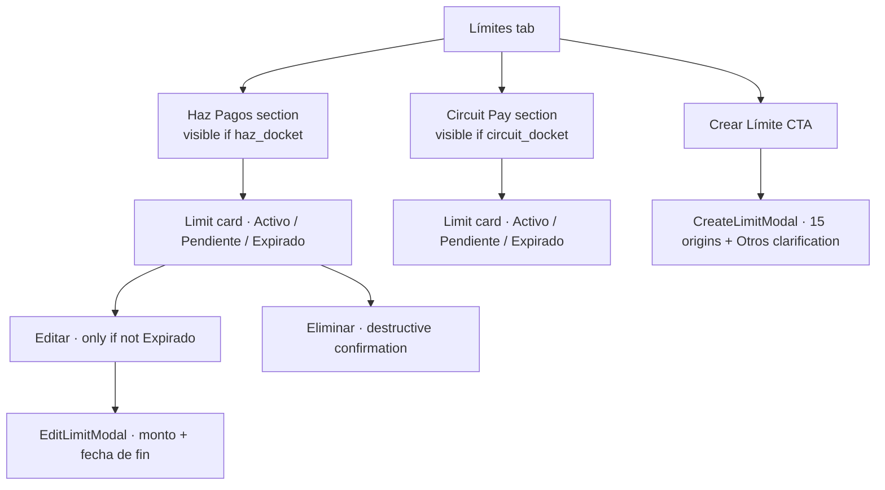
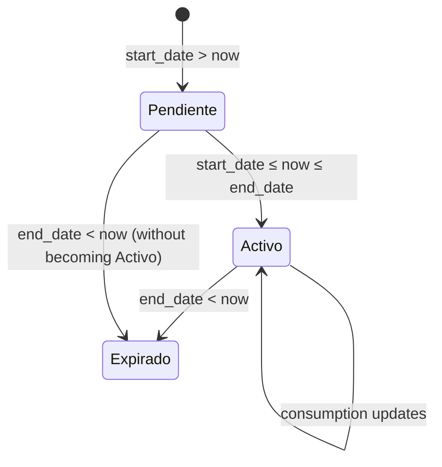

# Design — add-lex-limites

## Context

Lex asigna a cada Cliente un **límite operativo por entidad del grupo**: cuánto puede operar en un período determinado, anclado a evidencia documental del origen de fondos. Las dos entidades operativas son **Haz Pagos** y **Circuit Pay**, cada una con su propio docket en el Cliente (`haz_docket`, `circuit_docket`); la presencia o ausencia del docket gobierna si la sección correspondiente aparece en la tab.

El estado del Limit (Pendiente / Activo / Expirado) es **derivado** puramente de `start_date`, `end_date`, y la fecha actual. El backend no almacena `status` — el frontend lo computa con una función pura. Esto implica: dos pestañas abiertas a horas distintas pueden mostrar estados ligeramente distintos si una cruzó la hora del cambio (no es un bug; el estado se recomputa en cada render).

Dos REQs en flight extienden el v1:

- **REQ-44** — origen `Otros` requiere campo `Aclaración` (textarea, ≤500 chars). Conditional: solo visible y required cuando `Otros` está seleccionado en el multi-select. En la card, la pill `Otros` expone la clarificación como tooltip nativo (`title` HTML).
- **REQ-45** — Editar action en el card, limitado a `amount` + `end_date`, solo para limits non-Expirado, gated a ADMIN_LEX.

---

## Decision 1 — Sections segmentadas por entidad, gated por docket presence

### The question

¿Mostramos las dos secciones (Haz Pagos, Circuit Pay) siempre, o solo cuando el Cliente tiene el docket correspondiente?

### The decision

**Solo cuando el docket está presente.** Si `haz_docket` es null, la sección Haz Pagos no aparece. Si ambos son null, la tab Límites entera no es alcanzable (gated en `lex-cliente-detalle`). Order: Haz primero, Circuit segundo. Dentro de cada sección: Activo primero, después Expirado/Pendiente por `end_date` desc.

### Rationale

- **Sin docket no hay limit operacional.** La sección sería vacía y confusa.
- **Order Haz → Circuit** consistencia con el resto del legajo.
- **Activo first** — el estado relevante para operatoria del día es lo primero que el user ve.

### Tradeoff accepted

Si en el futuro Lex agrega una tercera entidad operativa, la spec hay que extender. Aceptado — un nuevo docket es un cambio deliberado.

---

## Decision 2 — Estado derivado por función pura, no almacenado

### The question

¿El estado (Pendiente/Activo/Expirado) viene del backend o lo computa el frontend?

### The decision

**Frontend computa con función pura `deriveLimitState({ start_date, end_date, now }): LimitState`.** No hay campo `status` en la API; el frontend lo deriva en cada render. Esto vale también para "is editable" (= state !== 'Expirado').

### Rationale

- **Single source of truth: las fechas.** Si el estado se persistiera, podría desincronizarse de las fechas reales.
- **Tests triviales** — la función es pura, casos de borde (just-expired, just-active) son fáciles de cubrir.
- **No race conditions** entre backend tick y frontend tick.

### Tradeoff accepted

Si el browser tiene fecha incorrecta, el estado mostrado es incorrecto. Aceptado — es responsabilidad del OS del user; el backend valida operaciones contra su propio reloj de todos modos.

---

## Decision 3 — Multi-select origens with conditional Aclaración (REQ-44)

### The question

¿Qué pasa cuando el user selecciona `Otros` en el multi-select de orígenes? ¿Qué metadata pedimos?

### The decision

**Aclaración conditional, required cuando Otros, oculta y limpiada cuando se deselecciona.** Textarea ≤500 chars con counter `0/500` visible. En la card, la pill `Otros` expone la clarificación como native `title` tooltip (no popover, no modal — hover plain).

### Rationale

- **Compliance regulatorio:** un `Otros` sin clarificación es inválido.
- **Conditional rendering** evita ruido visual cuando Otros no está seleccionado.
- **`title` tooltip nativo** — accessibility por default, sin componente custom.

### Tradeoff accepted

Limits creados antes de REQ-44 v1 no tienen Aclaración. Aceptado — la spec aclara explícitamente que limits pre-existentes renderizan sin tooltip.

---

## Decision 4 — Editar restringido a `amount` + `end_date`, non-Expirado, ADMIN_LEX (REQ-45)

### The question

¿Qué se puede editar? ¿Quién puede editar? ¿Limits expirados también?

### The decision

**Editar solo `amount` + `end_date`. Solo limits Activo o Pendiente. Solo ADMIN_LEX.** `start_date`, `origins`, y `Aclaración` son read-only en el modal. `end_date` debe seguir siendo > `start_date`.

### Rationale

- **`start_date` immutable** porque define el inicio del audit trail; cambiarlo invalidaría consumption history.
- **`origins` immutable** porque son la base regulatoria del limit; un cambio implica un nuevo limit.
- **`amount` y `end_date` editables** porque son los ajustes habituales (extender plazo, ampliar capacidad).
- **No edit en Expirado** — el limit ya cerró su ciclo.

### Tradeoff accepted

Si Compliance se equivoca al elegir un origin, tiene que eliminar el limit y crear uno nuevo. Aceptado — preserva la integridad del historial.

---

## Decision 5 — Limit card rendering: state badge + consumption + origin pills

### The question

¿Qué surfaceamos en cada card? ¿Cuánto detail?

### The decision

**Surface explícita:** state badge (Pendiente/Activo/Expirado con `--badge-*` tokens), date range `dd/MM/yyyy → dd/MM/yyyy`, amount con thousand separators, consumption progress bar con %, available o overage tag (si `consumed > amount`), pills por origen seleccionado.

### Rationale

- **State badge primero** — el user escanea primero qué está activo.
- **Progress bar** comunica consumption a glance.
- **Overage flag** es crítico — si un Cliente sobregira, Compliance debe saberlo inmediatamente.
- **Origin pills** evidencian la composición regulatoria.

### Tradeoff accepted

Una card con muchos origins (e.g. 7 pills) puede ocupar bastante espacio. Aceptado — overflow horizontal con scroll dentro del area de pills es preferible a truncar.

---

## Decision 6 — Eliminar destructive con warning de history loss

### The question

¿Cómo se elimina un limit? ¿Soft delete?

### The decision

**Hard delete con destructive confirmation.** Body del confirm muestra el date range + amount + warning explícito `Se elimina junto con el historial de consumo`. ADMIN_LEX only.

### Rationale

- **El warning es crítico** — un user que solo quiere "ajustar" puede pensar que delete es seguro.
- **Hard delete** porque limits son operacionales, no históricos.
- **ADMIN_LEX only** consistente con la regla "mutaciones críticas son ADMIN".

### Tradeoff accepted

No hay undo. Aceptado — el confirm con warning lo hace deliberadamente lento.

---

## Out of scope

- **Cómputo del consumed** vive en backend.
- **Histórico de cambios al limit** (audit log de quién aprobó qué) — futuro change.
- **Override del estado** (forzar a Pendiente / Activo manualmente) — no existe.
- **Bulk delete / bulk create** de limits — no es un workflow real.
- **Catálogo de origens dinámico** (cargado del backend) — los 15 actuales son hardcoded por compliance.
