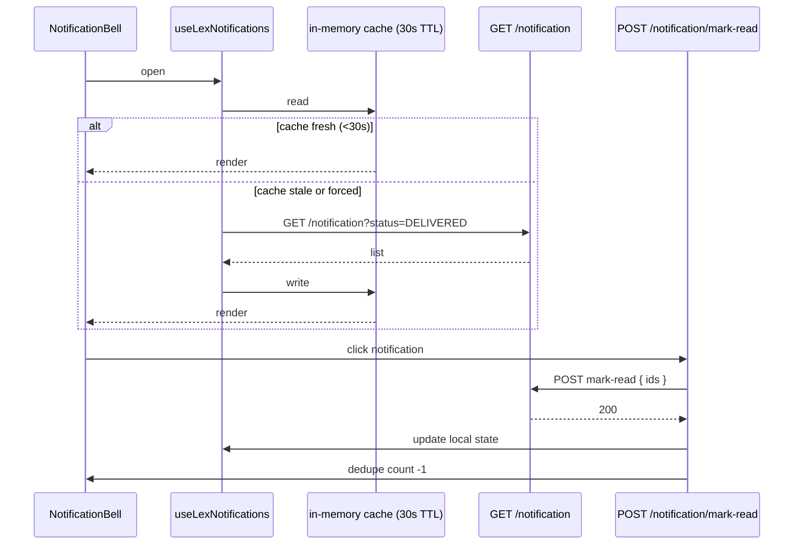
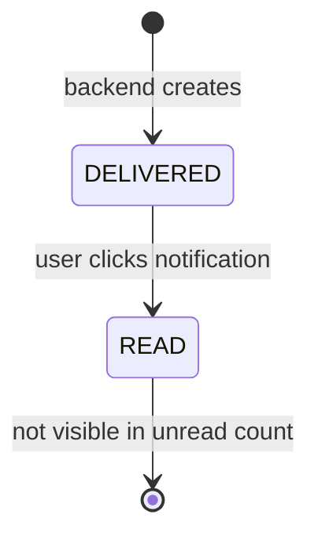

# Design — add-lex-notificaciones

## Context

Lex tiene **dos tipos de notificaciones** que se entregan a un usuario:

- **`CLIENT_ASSIGNMENT`** — alguien (típicamente un ADMIN_LEX) asignó un Cliente al user. Llega con `payload.client_id`. Click → navega a `/clientes/:client_id?tab=detalles` para que el user vea su nuevo asignado.
- **`DUE_DATE`** — una fecha de vencimiento se acerca o pasó. Llega con `payload.client_id`, `payload.scope` (`'cliente'` o `'relationship'`), y `payload.level` (uno de cinco: `expired`, `critical`, `warning`, `early_warning`, `ok`). Click → navega a `/clientes/:client_id?tab=documentos` (para vencimientos sobre relationships) o `?tab=detalles` (para vencimientos sobre el Cliente mismo).

El backend genera notificaciones; el frontend solo las consume. Esta spec gobierna el surface UI — políticas de generación viven en el backend.

---

## Decision 1 — Single composable + 30-second cache, force-flag for bypass

### The question

¿Cómo se sirven las notifs? ¿Pinia store global? ¿Composable con cache local? ¿Polling? ¿Server-sent events?

### The decision

**Composable `useLexNotifications()` con cache in-memory de 30 s.** Llamadas dentro de la ventana cache devuelven el cached value sin firing request. Force flag (`fetchNotifications(true)`) bypassa cache.

### Rationale

- **Un composable es suficiente** — no hay state cross-component complejo que justifique Pinia.
- **30 s alivia presión al backend** — el bell se abre y cierra varias veces por sesión.
- **Force flag para casos específicos** — e.g. el dev quiere refresh ahora, o un evento conocido invalida.

### Tradeoff accepted

Si una notif llega entre dos refreshes (≤ 30 s), el user no la ve hasta el próximo evento de refresh. Aceptado — es un workflow no-realtime; 30s de delay es invisible.

---

## Decision 2 — Badge dedupe by (client_id, type); popover one row per dedupe key

### The question

Si tengo 5 notifs `DUE_DATE` para el mismo Cliente (porque varias fechas vencen), ¿el badge muestra 5 o 1?

### The decision

**Dedupe por `(client_id, type)`. El badge muestra el count de unique pairs.** El popover renderiza una row por unique pair, mostrando el timestamp más reciente entre las raw notifs collapse-eadas. Badge oculto si count es 0.

### Rationale

- **Sino el badge se vuelve ruidoso** — cinco "el cliente Acme tiene un DUE_DATE" no aporta valor sobre uno.
- **Una row por dedupe** preserva la info más útil (el más reciente) sin spam visual.
- **Hidden cuando 0** es la regla universal de badges.

### Tradeoff accepted

Un usuario que quiere ver TODAS las notifs raw (no deduped) no tiene esa view en el bell — tiene que ir al Cliente. Aceptado — el bell es triage, no log forense.

---

## Decision 3 — Click marks read optimistically + navigates per type

### The question

¿Click hace mark-as-read antes o después de navegar? ¿Navegación per type?

### The decision

**Optimistic update + navigate.** Click → status flips local a `READ` y badge count -1 → `POST /notification/mark-read` async → navigate por type. Failure rollbackea + toast `No se pudo marcar como leída` con Reintentar. Navegación:
- `CLIENT_ASSIGNMENT` → `/clientes/:client_id?tab=detalles`
- `DUE_DATE` con `scope='relationship'` → `/clientes/:client_id?tab=documentos`
- `DUE_DATE` con `scope='cliente'` → `/clientes/:client_id?tab=detalles`

### Rationale

- **Optimistic se siente snappy.**
- **Per-type navigation** lleva al user al lugar útil — no a la home del Cliente.
- **Rollback con Reintentar** para edge case.

### Tradeoff accepted

En condiciones de red mala, el rollback puede confundir. Aceptado — el toast Reintentar es claro.

---

## Decision 4 — DUE_DATE urgency mapped to --severity-* CSS variables

### The question

¿Cómo señalamos visualmente la urgencia de un DUE_DATE? ¿Texto? ¿Icon? ¿Color?

### The decision

**Icon coloreado per `level` con CSS variables `--severity-*`:**
- `expired` → `--severity-expired` (rojo intenso)
- `critical` → `--severity-critical` (rojo)
- `warning` → `--severity-warning` (naranja)
- `early_warning` → `--severity-early-warning` (amber)
- `ok` → `--severity-ok` (gris)

Texto incluye `days_remaining` (negativo para expired).

### Rationale

- **CSS variables** = theme-able, single change point.
- **Cinco niveles** cubre la realidad regulatoria (no todo es "vencido / a vencer").
- **`ok` aparece** porque algunas alertas tempranas ya no son urgentes pero el sistema las generó.

### Tradeoff accepted

Un user color-blind necesita interpretar el icon shape O el texto, no solo el color. Aceptado — el texto incluye días, suficiente fallback.

---

## Decision 5 — Auth errors: consent_required → loginWithRedirect; 401 → global handler

### The question

Si `getAccessTokenSilently()` falla con `consent_required` o `login_required`, ¿qué hacemos? ¿Y si el server tira 401?

### The decision

**Tres tipos de error, tres caminos:**
- `consent_required` / `login_required` from Auth0 → `loginWithRedirect({ authorizationParams: { prompt: 'consent' } })`. No surface toast — el redirect ya es el feedback.
- 401 from backend → global handler en `core-error-handling` (logout + redirect).
- Network error → keep cached value visible + toast `No se pudieron actualizar las notificaciones · Reintentar`.

### Rationale

- **Auth0 `consent_required` significa que el user tiene que re-consentir** — un toast no resuelve, el redirect sí.
- **401 tiene su own pipeline** — no duplicamos.
- **Cache visible en network error** porque es UX importante: el bell con datos viejos > el bell vacío con error.

### Tradeoff accepted

Si el user ignora el "No se pudieron actualizar" toast varias veces, ve datos cada vez más stale. Aceptado — el cache se actualizará en cuanto la red vuelva, y el toast les avisa.

---

## Decision 6 — Event-driven refresh (no polling); logout clears cache

### The question

¿Polling cada N segundos? ¿Solo on-demand? ¿WebSocket / SSE?

### The decision

**Event-driven, no polling.** Refresh fires en: (1) Topbar `onMounted`, (2) bell popover open, (3) explicit `fetchNotifications(true)`. Logout llama `clearCache()` antes del Auth0 redirect para resetear estado.

### Rationale

- **Polling cada 30 s/N usuarios = carga linear al backend** sin valor cuando el user no está mirando.
- **Event-driven es suficiente** para un workflow non-realtime.
- **Logout cache clear** evita que la próxima sesión vea state stale del user previo.

### Tradeoff accepted

Una notif que llega justo después de cerrar el bell tarda hasta 30 s + el próximo evento (lease re-abrir el bell). Aceptado — el use case "estaba mirando el bell justo ahora" es raro.

---

## Out of scope

- **Backend rules** sobre cuándo se generan notifs.
- **Real-time push (WebSocket / SSE)** — futuro change si hace falta.
- **Notif persistence en localStorage** — el cache es in-memory; reload fetchea fresco.
- **User preferences** (mute, snooze, agrupar por días) — futuro change.
- **Email / push externo** — no scope frontend.
