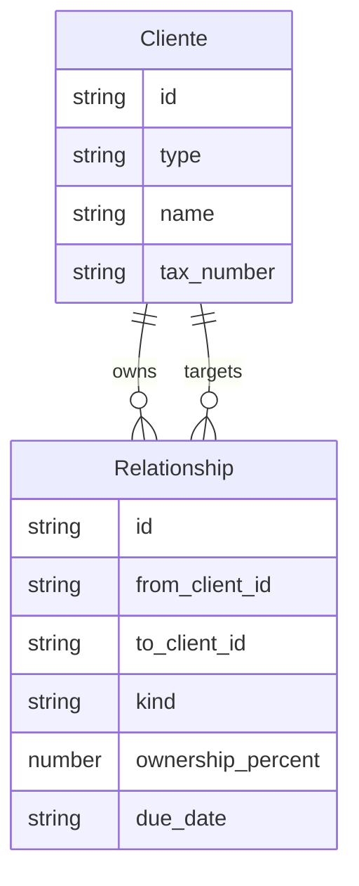
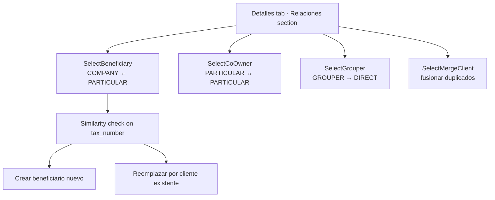

# Design — add-lex-relaciones

## Context

El **legajo Lex** modela cuatro tipos de vínculo entre Clientes:

- **`BENEFICIARY`** — un PARTICULAR es beneficiario final (UBO) de una COMPANY. Lleva `ownership_percent` (porcentaje de participación) y `beneficiary_due_date` (fecha de revisión obligatoria).
- **`CO_OWNER`** — dos PARTICULAR comparten cotitularidad de algo (cuenta, operatoria). Sin metadata.
- **`GROUPER`** — un Cliente AGRUPADOR engloba a uno o más Clientes DIRECT (relación 1:N en términos de directos por agrupador, pero **1:1** en sentido de "un DIRECT tiene a lo sumo un GROUPER"). Sin metadata.
- **Merge** — operación de consolidación: el Cliente A se fusiona en el Cliente B; A deja de existir y todas sus relaciones, documentos, dockets pasan a B. Reservado a `ADMIN_LEX`.

Esos vínculos viven en la sección Relaciones de la Detalles tab. El legacy tiene cinco componentes de selección, cada uno reimplementando el mismo patrón básico (search Cliente, pick one, attach con metadata específica del kind), con divergencias menores que la gente nota cuando trabaja en uno o el otro:
- El debounce del search varía (200 ms en uno, 500 ms en otro)
- El virtualizado de la lista de candidates está en algunos sí y en otros no
- La validación de metadata no es consistente (e.g. `ownership_percent=120` se acepta en un componente y se rechaza en otro)

---

## Decision 1 — Single base composable; pickers as thin wrappers

### The question

¿Cinco componentes independientes con código duplicado? ¿Una herencia con mixin? ¿Un base composable que cada picker compone?

### The decision

**Composable `useRelationshipPicker<T>()` como base, pickers thin wrappers.** El base acepta `{ kind, parentClientId, onAttach, onCancel }` y entrega: search input debounced 300 ms, virtualised candidate list, optional `Crear nuevo` CTA, slots para metadata fields per-kind. Cada picker es un wrapper de ~50-100 LOC que pasa la kind, el filtro de tipos válidos, y los metadata fields.

### Rationale

- **Single source of truth** para search-debounce-list-popover.
- **Cambios de UX (e.g. cambiar virtualizado por scroll infinito) se aplican una vez.**
- **Tests del base cubren el 80% de la lógica** — los wrappers necesitan sólo tests de su metadata-specific.

### Tradeoff accepted

Un picker con UX muy specific (e.g. un wizard multi-step para agregar un beneficiario complejo) tendría que romper la abstracción. Aceptado — al día de hoy ningún picker requiere eso, y si llega, será otro composable.

---

## Decision 2 — Beneficiary metadata: ownership_percent + beneficiary_due_date as required fields

### The question

¿Qué metadata pide BENEFICIARY? ¿Bloqueante? ¿Optional? ¿Cuántos decimales?

### The decision

Dos campos required: `ownership_percent` (number, 0 < x ≤ 100, 2 decimales máx) y `beneficiary_due_date` (date, debe estar en futuro). Validación con vee-validate + zod. Submit deshabilitado mientras el form sea inválido.

### Rationale

- **`ownership_percent` es regulatorio** — UBO declarations requieren el porcentaje exacto.
- **`beneficiary_due_date`** activa el flujo de notificaciones de vencimiento (`lex-notificaciones` `DUE_DATE`).
- **Bounded between 0 and 100 con 2 decimals** — coincide con la representación regulatoria.

### Tradeoff accepted

Un beneficiario que no tiene un porcentaje claro (e.g. esquemas de fideicomiso) requiere una decisión externa. Aceptado — el negocio decide con qué número cargarlo, no Lex.

---

## Decision 3 — Similarity warning offers `Reemplazar por este cliente` (merge-on-create)

### The question

Cuando alguien va a crear un beneficiario PARTICULAR nuevo, el backend puede detectar que ya existe un PARTICULAR con un CUIT muy parecido. ¿Qué hacemos? ¿Bloqueamos? ¿Avisamos? ¿Ofrecemos reemplazar?

### The decision

**Avisamos y ofrecemos reemplazar.** Inline warning con el match, score, y CTA `Reemplazar por este cliente`. Click en el CTA salta la creación: en lugar de `POST /client` + después attach, hace directo `POST /client/:companyId/relationships { to_client_id }` referenciando el Cliente existente. Es la versión "atajo" de un merge.

### Rationale

- **Evitar duplicados** es alta prioridad en compliance.
- **El attach directo a un Cliente existente** preserva su histórico y evita una operación de merge posterior.
- **Sin bloquear** porque pueden haber casos legítimos.

### Tradeoff accepted

Un usuario que ignora el warning y crea de todos modos puede generar un duplicado. Aceptado — ese flujo desemboca en un merge manual posterior por ADMIN_LEX.

---

## Decision 4 — CO_OWNER: PARTICULAR↔PARTICULAR only, self-attachment blocked, dup guard

### The question

¿Una empresa puede ser cotitular de un PARTICULAR? ¿Un PARTICULAR puede ser cotitular de sí mismo? ¿Se puede agregar el mismo cotitular dos veces?

### The decision

**Tres reglas estrictas:**
- Source y target deben ser ambos `PARTICULAR`.
- Self-attachment bloqueado: el parent no aparece en la candidate list.
- Duplicados bloqueados: cotitulares ya agregados aparecen disabled con tooltip `Ya es cotitular`.

### Rationale

- **El dominio define qué pares son válidos.** Una COMPANY como cotitular de un PARTICULAR no tiene sentido legal en el modelo Lex.
- **Self-cotitularidad** no es un concepto.
- **Doble cotitulares** sería un bug — la lista debe ser un set.

### Tradeoff accepted

Si el modelo evoluciona (e.g. permitir cotitulares COMPANY ↔ PARTICULAR), hay que extender el spec. Aceptado — son cambios deliberados.

---

## Decision 5 — GROUPER: 1:1 from DIRECT side, replace requires destructive confirm

### The question

¿Un DIRECT puede tener varios GROUPERS? ¿Cómo cambiamos de GROUPER?

### The decision

**1:1 desde el lado DIRECT.** Cada DIRECT tiene a lo sumo un GROUPER. Reasignar a otro GROUPER pasa por una destructive confirmation modal explicando que la relación previa será reemplazada. Solo después del confirm se hace `POST /client/:directId/relationships`.

### Rationale

- **El modelo de negocio lo requiere** — un DIRECT pertenece a un solo agrupador.
- **El confirm es destructivo** porque reemplaza un vínculo previo.

### Tradeoff accepted

Si el negocio decide en el futuro permitir múltiples GROUPERS por DIRECT, es un OpenSpec change. Aceptado.

---

## Decision 6 — Merge: ADMIN_LEX only, irreversible, redirects to target

### The question

¿Cómo consolidamos dos Clientes duplicados? ¿Quién puede? ¿Se preserva el origen?

### The decision

**`SelectMergeClient` exposed only to ADMIN_LEX.** Click → search target Cliente (excluyendo el source) → destructive confirmation enumera lo que se mueve (X documentos, Y relaciones) → `POST /client/:sourceId/merge { target_client_id }` → 200 redirige a `/clientes/:targetId?tab=detalles` + alert banner persistente "Cliente fusionado · acción no reversible".

### Rationale

- **Es la operación más destructiva de Lex.** Solo ADMIN_LEX.
- **Confirmation enumera lo que migra** — el ADMIN ve el impacto antes de confirmar.
- **No hay undo.**
- **Redirect al target** porque el source dejó de existir.

### Tradeoff accepted

Un merge erróneo no se puede revertir desde Lex. Aceptado — el confirm con enumeración + el alert banner reducen drásticamente el risk.

---

## Decision 7 — Quitar destructive confirmation, hidden for VIEWER_LEX

### The question

¿Cómo se elimina una relación existente? ¿Inline? ¿Modal? ¿Quién puede?

### The decision

**Modal destructivo per `core-modals`.** Header danger-accent, body con nombre del Cliente target, action `Quitar`. `DELETE /client/:parentId/relationships/:id`. Hidden para VIEWER_LEX. ADMIN_LEX y COMMERCIAL_LEX pueden quitar (consistente con que pueden agregar).

### Rationale

- **Consistencia con el resto de Lex** — toda eliminación va por modal destructivo.
- **VIEWER_LEX no muta nada.**

### Tradeoff accepted

COMMERCIAL_LEX puede quitar relaciones que solo debería poder agregar. Aceptado — la matriz de roles en `lex-roles` cubrió esto al permitirle el rango de modificación de Detalles.

---

## Out of scope

- **Histórico de relaciones removidas** — un audit log de Quitar vive en `lex-cliente-detalle` (Actividad tab).
- **Bulk merge** — fusionar tres Clientes en uno requiere dos operaciones secuenciales.
- **Cross-tipo relaciones futuras** (e.g. COMPANY↔COMPANY como matriz/subsidiary) — futuro change si el modelo lo necesita.
- **Templates de metadata por kind** — los pickers tienen los campos que necesitan; un sistema generic de metadata es overkill.
