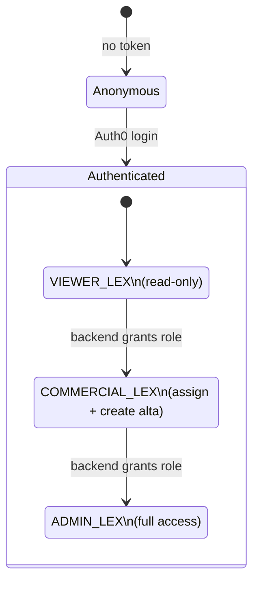

# Design — add-lex-roles

## Context

Lex (Legal File Management) is the Ardua core app that owns the client legajo: KYC/KYB onboarding, documents, relationships, limits, audit logs, blacklists. Three operational personas interact with the legajo, and Lex enforces what each persona can see and do at the UI layer:

- **`VIEWER_LEX`** — Compliance/Legal staff who audit the legajo without mutating it. Read-only across every surface.
- **`COMMERCIAL_LEX`** — Commercial team who triage `Altas` (pending-review clients) and assign clients to themselves, but MUST NOT read the audit timeline or the document vault — those surfaces contain compliance-sensitive material outside the commercial role's scope.
- **`ADMIN_LEX`** — Compliance/Legal admins with full access including limits editing.

The legacy frontend reads `user.USER_ROLES` directly in components and helpers (`hasRole`, `hasCommercialLexRole`, `hasAdminLexRole` in `src/lib/utils.js`). Each page that gates UI by role re-implements the check inline; the rules are scattered across `clientes.vue`, `altas.vue`, `client-details.vue`, and the four `ClientTabs/*.vue` components. Reviewers cannot read the gating contract from one place; new pages re-derive it from the pages they were copy-pasted from. Token refreshes do not propagate cleanly because the role booleans are computed once per render rather than as reactive derivations of the auth state.

The new project (Vue 3 + TS + `@auth0/auth0-vue` + Pinia) locks all of this into a single composable backed by a typed contract.

This design captures the non-obvious decisions and their tradeoffs.

---

## Permission matrix (locked here, referenced everywhere)



The diagram is informational. Roles are not transitioned by the frontend — they reflect the value present in the Auth0 token at session start.

| Surface | `VIEWER_LEX` | `COMMERCIAL_LEX` | `ADMIN_LEX` |
|---|---|---|---|
| `/clientes` table | read | read + assign self | full |
| `/altas` table | read | read + create + assign + delete | full |
| `/clientes/:id` → Detalles | read | read + edit (limited) | full |
| `/clientes/:id` → Actividad | read | **denied** | full |
| `/clientes/:id` → Documentos | read | **denied** | full |
| `/clientes/:id` → Límites | read | read | full (edit) |
| `/usuarios` | read | read | full |
| `/usuarios/blacklist` | read | read | full |

Downstream Lex specs cite this matrix when they need a role-gating Scenario. If a downstream spec contradicts the matrix, the downstream spec wins for the concrete behaviour it covers — but it MUST cite the deviation explicitly.

---

## Decision 1 — Roles come from the Auth0 `USER_ROLES` claim, never from anywhere else

### The question

Where does the runtime read role identifiers from? Options on the table: (a) the Auth0 `USER_ROLES` array on the decoded token; (b) a Lex-specific `/me` backend endpoint that returns roles + extra context; (c) a feature-flag system (LaunchDarkly) for fine-grained per-user overrides.

### The decision

**Auth0 `USER_ROLES` claim is the only source.** Roles MUST be read off `user.USER_ROLES` from the Auth0-decoded user object exposed by `core-auth`. Frontend MUST NOT derive, infer, or override roles from query parameters, local storage, feature flags, or hardcoded constants. A `/me` endpoint that returns roles is forbidden — it would make `lex-roles` depend on a backend round-trip and create a gap between what the token says and what the UI gates on.

### Rationale

- **Single source of truth.** The token already carries the claim; using it directly removes the possibility of UI-vs-API divergence.
- **Auth0 is the only system that grants/revokes roles.** Adding a parallel source means every change to the role catalogue needs two updates.
- **Refresh story is built-in.** When Auth0 refreshes the token (silent refresh, re-login), the new `USER_ROLES` array flows through `useAuth()` → `useLexRole()` → component flags reactively.

### Tradeoff accepted

Per-user overrides for testing (e.g. "let me preview the page as `VIEWER_LEX` in QA") are NOT supported by `lex-roles`. Testing happens by signing in as a fixture user with the desired role, or via Vitest unit tests that mock the composable. We pay the inconvenience to prevent the security footgun of role spoofing via query param or browser console.

---

## Decision 2 — Three role identifiers, no more, no fewer

### The question

The legacy code recognises three roles (`VIEWER_LEX`, `COMMERCIAL_LEX`, `ADMIN_LEX`) but the helpers (`hasRole`) accept arbitrary strings. Should `lex-roles` lock the set, or accept any role and let downstream specs add identifiers as they need them?

### The decision

**The set is closed: `'VIEWER_LEX' | 'COMMERCIAL_LEX' | 'ADMIN_LEX'`.** Identifiers outside this union are ignored by the runtime. The TS union and a runtime constant array live at `src/types/lexRoles.ts` and are the only valid spelling. Identifiers are case-sensitive.

```ts
// src/types/lexRoles.ts
export type LexRole = 'VIEWER_LEX' | 'COMMERCIAL_LEX' | 'ADMIN_LEX';

export const LEX_ROLES = ['VIEWER_LEX', 'COMMERCIAL_LEX', 'ADMIN_LEX'] as const satisfies readonly LexRole[];
```

### Rationale

- **A typed union catches typos at build time.** `if (role === 'VIWER_LEX')` becomes a TS error.
- **Downstream specs cite the matrix in `## Context`.** If `lex-roles` accepts arbitrary strings, the matrix loses meaning — there could be a fourth role tomorrow that no spec mentions.
- **Adding a fourth role is a deliberate, traceable change.** Open a new OpenSpec change that modifies `lex-roles`; do not silently extend the union.

### Tradeoff accepted

We block the case where Lex grows a fourth role (e.g. `AUDITOR_LEX`) without a corresponding spec change. That is intentional — a new role implies a new column in the matrix, which is the kind of decision that should not be made silently in code.

---

## Decision 3 — A single composable, every component goes through it

### The question

How do components consume role flags? Options: (a) a Pinia store with `isAdmin`, `isCommercial` getters; (b) a composable `useLexRole()` that returns Vue reactive refs; (c) keep the legacy pattern — components call helpers like `hasAdminLexRole(user)` directly.

### The decision

**Composable: `useLexRole()`.** Components MUST consume role state via `useLexRole()`. Direct inspection of `user.USER_ROLES` from any other location is forbidden — including from helper functions outside the composable file.

```ts
// usage
const { isViewer, isCommercial, isAdmin, hasRole } = useLexRole();
// in template
<button v-if="isAdmin">Editar límite</button>
```

The composable internally subscribes to `useAuth()` from `core-auth` and re-derives the flags as the auth state changes.

### Rationale

- **One file, one contract.** A reviewer reads `useLexRole.ts` once and knows the entire gating surface.
- **Reactive by construction.** Using `computed()` over the auth ref means token refreshes propagate without touching components.
- **Lint-enforceable.** A custom ESLint rule banning `USER_ROLES` reads outside `useLexRole.ts` is straightforward to write; with a Pinia store you would have to ban store-internals reads instead.

### Tradeoff accepted

A composable creates a new instance of the reactive computeds per component using it. The cost is microscopic (Vue's reactivity scales fine to thousands of consumers) but it is non-zero versus a single Pinia store. We pay it for the simpler mental model.

---

## Decision 4 — Server-side filtering belongs to the backend; client-side gating belongs to this spec

### The question

The legacy code mixes two concerns: hiding UI affordances based on role (e.g. no "Crear" button for `VIEWER_LEX`) AND filtering API request parameters based on role (e.g. `visible_statuses` and `assigned_users` query params on `GET /client`). Should `lex-roles` cover both?

### The decision

**`lex-roles` covers ONLY client-side gating.** UI affordances (buttons, menu items, tabs, form submit controls) are governed by Requirements in this spec. Backend-side filtering of `visible_statuses`, `assigned_users`, or any other server-applied data restriction is the backend's responsibility; the frontend simply forwards the auth token and trusts the backend to scope the response.

### Rationale

- **Defence in depth.** A `VIEWER_LEX` user who crafts a manual `DELETE /client/:id` request still gets rejected at the backend with 403 — the frontend gating is convenience, not security.
- **Single responsibility per spec.** Mixing UI gating and API param construction makes `lex-roles` a god-object.
- **Server is authoritative.** If `lex-roles` redefined what `visible_statuses` means, the spec would drift from the backend contract every time the backend changes.

### Tradeoff accepted

A page that constructs a query like `GET /client?visible_statuses=PENDING_REVIEW` for a `VIEWER_LEX` does so based on its own knowledge of the surface, not because `lex-roles` told it to. That coupling is local to each Lex page spec (e.g. `lex-clientes`) which is the right place — the page knows what subset of data it surfaces. `lex-roles` only locks who reaches each page in the first place.

---

## Decision 5 — Reactive flags survive token refresh; logout clears them before the redirect

### The question

When Auth0 refreshes the access token silently, the new claim set may include a role change (e.g. backend granted `ADMIN_LEX` to a previously `VIEWER_LEX` user). When the user logs out, the redirect to `/login` happens after the auth state clears. Should role flags update in both cases?

### The decision

**Yes, both cases.** The composable returns Vue `computed()` refs over the auth state, so a silent refresh that updates `user.USER_ROLES` flips the flags within the same render cycle. On logout, the flags resolve to `false` BEFORE the navigation guard fires — so any component still mounted during the unmount sequence sees the post-logout state, not the stale pre-logout one.

### Rationale

- **Avoids the "hidden then shown then gone" flicker.** If logout cleared the auth ref *after* the redirect, mounted components would briefly re-render with a null user and stale role flags.
- **Token refresh without page reload is a real flow.** Long-running Lex sessions (an admin reviewing a legajo for 30 minutes) hit silent refresh; permission changes that came from the backend MUST take effect without forcing the user to F5.

### Tradeoff accepted

A component that subscribed to `isAdmin` and saw it flip `false → true → false` because the backend granted-then-revoked between two refreshes is an edge case we accept. The composable just mirrors auth state; reasoning about transient role changes belongs to whoever provisions roles in Auth0.

---

## Out of scope

- **Role discovery from a `/me` endpoint** — rejected in Decision 1.
- **Per-user overrides via feature flags** — rejected in Decision 1.
- **Adding a `LEX_AUDITOR` or `LEX_SUPPORT` role** — would require a new OpenSpec change that modifies `lex-roles` and the matrix.
- **Role-based filtering of API responses** — backend's responsibility, not this spec (Decision 4).
- **Vue Router guards that redirect a `VIEWER_LEX` away from a forbidden page** — covered by `core-navigation` and consumed by `lex-cliente-detalle` for the Actividad/Documentos sub-tabs; this spec's job is to provide the predicates the guards consume.
