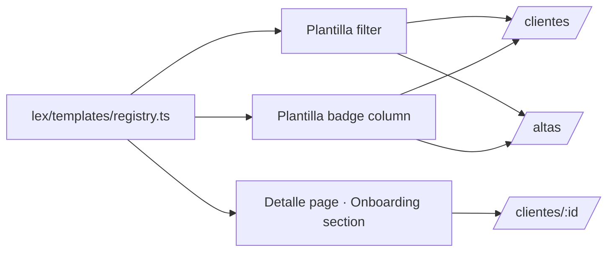

# Design — add-lex-templates

## Context

Lex onboarding flows (`KYC` para personas físicas, `KYB` para personas jurídicas) son el primer paso del legajo: cuando se carga un nuevo Cliente en `/altas`, el frontend lo asocia a una de **ocho plantillas** que combinan dos dimensiones — origen (Ardua Solutions Corp / Local) y modalidad (KYC, KYC Analista Legales, KYB) — más dos variantes (`-extra`) que el negocio incorporó después del v1 inicial. Cada plantilla tiene una etiqueta corta (para celdas de tabla), una etiqueta completa (para encabezados y secciones de detalle), y un token de color (para badges con un acento visual reconocible por solapa).

El frontend legacy declara las ocho plantillas en `src/constants/providerTemplates.js` como un objeto `{ uuid: { label, color, ... } }` y exporta un par de helpers (`getTemplateLabel(id)`, `getTemplateColor(id)`). En la práctica las páginas mezclan los caminos: algunas leen del helper, otras importan el objeto y resuelven a mano, y `client-details.vue` directamente repite el label de la plantilla en su section header en vez de leer del registro. Cuando el negocio agrega `ardua-kyc-extra` (la variante v2 de KYC Ardua), el cambio se filtra a las tablas pero no a los headers de detalle; cuando renombran `Local KYB` a `Local KYB v1`, el badge cambia y el filter Select queda desactualizado.



| Template id (canonical) | Origin | Modality | Short label | Color token |
|---|---|---|---|---|
| `ardua-kyc` | Ardua | KYC | `Ardua KYC` | `--badge-template-ardua-kyc` |
| `ardua-kyc-al` | Ardua | KYC (Analista Legales) | `Ardua KYC AL` | `--badge-template-ardua-kyc-al` |
| `ardua-kyb` | Ardua | KYB | `Ardua KYB` | `--badge-template-ardua-kyb` |
| `local-kyc` | Local | KYC | `Local KYC` | `--badge-template-local-kyc` |
| `local-kyc-al` | Local | KYC (Analista Legales) | `Local KYC AL` | `--badge-template-local-kyc-al` |
| `local-kyb` | Local | KYB | `Local KYB` | `--badge-template-local-kyb` |
| `ardua-kyc-extra` | Ardua | KYC (variant) | `Ardua KYC v2` | `--badge-template-ardua-kyc-extra` |
| `local-kyb-extra` | Local | KYB (variant) | `Local KYB v2` | `--badge-template-local-kyb-extra` |

La matriz es la fuente única de verdad para el frontend. Los UUIDs canónicos son los valores que la base ya tiene en producción — el porting copia esos UUIDs verbatim; cualquier divergencia es un bug, no una decisión de diseño.

---

## Decision 1 — Single typed registry, no inline UUIDs anywhere

### The question

¿Dónde viven los identificadores de plantilla y los componentes los buscan? Opciones: (a) un archivo único típed exportando `LEX_TEMPLATES`; (b) un endpoint `/templates` que devuelve la lista al iniciar la app; (c) un Pinia store inicializado al login.

### The decision

**Archivo único: `src/lex/templates/registry.ts`** que exporta el union `LexTemplateId`, el objeto `LEX_TEMPLATES` indexado por id, y el array `LEX_TEMPLATE_IDS`. Páginas y componentes MUST importar desde ese archivo — leer un UUID literal en una página o reescribir un label es rechazado en review.

```ts
export type LexTemplateId = 'ardua-kyc' | 'ardua-kyc-al' | 'ardua-kyb' | 'local-kyc'
  | 'local-kyc-al' | 'local-kyb' | 'ardua-kyc-extra' | 'local-kyb-extra';

export interface LexTemplate {
  id: LexTemplateId;
  label: string;
  shortLabel: string;
  origin: 'Ardua' | 'Local';
  modality: 'KYC' | 'KYC_AL' | 'KYB';
  colorToken: `--badge-template-${string}`;
}

export const LEX_TEMPLATES: Record<LexTemplateId, LexTemplate> = { /* eight entries */ };
export const LEX_TEMPLATE_IDS = [/* in declaration order */] as const;
```

### Rationale

- **TS catches typos.** `if (template.id === 'arda-kyc')` rompe el build.
- **Cero round-trip.** Las plantillas no cambian a runtime; cargarlas desde el cliente evita un fetch extra al boot y elimina la posibilidad de que un componente intente renderizar un badge antes de que el endpoint resuelva.
- **Lint-enforceable.** Una regla ESLint que prohibe literales UUID hex de 32+ chars y prohibe `tailwind` classes para templates fuera de `registry.ts` es trivial.

### Tradeoff accepted

Agregar una novena plantilla requiere un OpenSpec change que modifique `lex-templates` y un release del frontend. Si Compliance crea una plantilla en backend y el frontend no la conoce todavía, el badge cae al fallback neutral (Decision 3). Es la fricción correcta — agregar un template implica decidir el color, el short label, y la posición en el filter, no es un side-effect transparente.

---

## Decision 2 — Short labels conducen tablas y badges; full labels conducen Detalle

### The question

¿Qué etiqueta se renderiza en cada superficie? El legacy mezcla criterios — algunas tablas muestran `Ardua KYC`, otras muestran `KYC Ardua`, el detalle muestra a veces `Plantilla: Ardua KYC` y a veces el UUID directo cuando el helper falla.

### The decision

**Dos etiquetas por plantilla, con uso fijo:**

- `shortLabel` (≤ 12 chars cuando es posible) — celdas de tablas (`/clientes`, `/altas`), tooltips → muestra el `label` completo en el `title` HTML.
- `label` — Onboarding section del Cliente Detalle (`/clientes/:id?tab=detalles`), filter Select labels.

### Rationale

- **Densidad en tablas.** Una columna Plantilla tiene típicamente ~80px; `Ardua KYC AL` cabe, `Ardua KYC (Analista Legales)` no — y truncar con CSS empeora el escaneo visual.
- **Hover descubre el resto.** El attribute `title` da al usuario power-user la etiqueta completa sin gastar espacio.
- **Detalle tiene espacio sobrado.** La sección Onboarding de Detalles tiene un header dedicado; la etiqueta completa cabe sin esfuerzo.

### Tradeoff accepted

Páginas que quieran reusar la etiqueta corta en headers (por experimentación visual) no pueden — la regla es estricta. Es deliberado: la consistencia visual entre tablas vale más que la flexibilidad por-página.

---

## Decision 3 — UUIDs desconocidos no rompen la página, sólo emiten un `devWarn`

### The question

¿Qué hace el frontend si recibe del backend un `template_id` que no está en `LEX_TEMPLATES`? Opciones: (a) tirar excepción; (b) renderizar nada y silencio; (c) renderizar el id literal con badge neutral + warning de dev.

### The decision

**Opción (c).** El cell muestra el string crudo del id, aplica la variante neutral del badge, y `core-error-handling` `devWarn` reporta una vez por sesión que existe un template id desconocido. La página continúa funcionando.

### Rationale

- **Resiliencia ante desfases backend ↔ frontend.** Un nuevo template recién añadido en backend no debería frenar la página antes del próximo release del frontend.
- **El warning conduce el bug a un sitio.** El dev que abre devtools ve el missing id; producción no muestra nada al usuario.
- **No silenciar es importante.** Renderizar nada esconde el problema y oculta que hubo un template realmente cargado.

### Tradeoff accepted

Un usuario power que crea filtros podría deep-linkar a `?template_id=unknown` y recibir un cell renderizado pero sin badge. Aceptado — no es un caso real (el filter Select sólo expone los ocho válidos), y el comportamiento es defensible visualmente.

---

## Decision 4 — Filter siempre desde el registro; never inline una option list

### The question

El filter Plantilla en `/clientes` y `/altas` necesita una lista de opciones. Cada página podría hardcodear las opciones, o leer del registro. ¿Cuál?

### The decision

**Siempre del registro, vía `LEX_TEMPLATE_IDS.map(id => LEX_TEMPLATES[id])`.** Las opciones aparecen en orden de declaración (no alfabético) — la matriz fija el orden y eso es deliberado: agrupa Ardua antes de Local, y dentro de cada origen lleva KYC → KYC AL → KYB.

### Rationale

- **Single source of truth.** Cualquier cambio en `LEX_TEMPLATES` se propaga al filter.
- **Orden es información.** Un usuario que abre el filter ve Ardua agrupado; el orden alfabético separaría Ardua KYB de Ardua KYC.
- **El value es el id, no el label.** El backend recibe `template_id=ardua-kyc`, no `template_id=Ardua KYC`.

### Tradeoff accepted

Páginas que quisieran customizar el orden por contexto (e.g. "para `/altas`, mostrar primero las plantillas más usadas") no pueden hacerlo sin modificar el registro o agregar un nuevo nivel de configuración. Aceptado — el costo es ínfimo y la consistencia entre páginas paga la inflexibilidad.

---

## Out of scope

- **Validación server-side de qué template aplica a qué tipo de Cliente** (PARTICULAR vs COMPANY). Esto vive en backend y se refleja sólo cuando el endpoint de creación rechaza la combinación.
- **Internacionalización de labels.** Single-locale (Español) hasta que `core-i18n` esté wired; entonces `label` y `shortLabel` se mueven a un message bundle.
- **Versionado de templates.** Los `-extra` actuales son v2 conceptuales pero el registro los trata como ids independientes. Si Lex evoluciona a un esquema de versionado real, será otro change.
- **Visibilidad de templates por rol.** `lex-roles` no gates por template; cualquier rol que vea el listado ve todas las plantillas que el backend devuelva.
