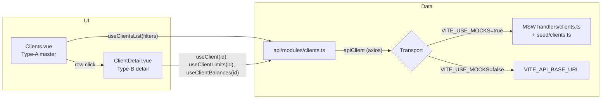

# Design — add-trd-clients

## Context

`add-trd-clients` is the first TRD migration capability. It establishes the patterns every subsequent `add-trd-*` change will inherit. The closest worked example is `add-ops-clients` (archived 2026-05-08, prototypes/ops/openspec/changes/archive/2026-05-08-add-ops-clients/).

This design pulls **only the patterns that apply** from OPS — list + filters + URL sync + master/detail split. It explicitly drops OPS-specific machinery: PSP whitelisting, step-up MFA, account instructions, letter generation, sign-up flow.

## Architecture



The L1 / L3 layout follows `core-layout`:

```
┌─────────────────────────────────────────────────────────────────┐
│ L1: Clientes                                          (no CTA) │
├─────────────────────────────────────────────────────────────────┤
│ L3: [ 🔍 Buscar por nombre o legajo... ]                       │
├─────────────────────────────────────────────────────────────────┤
│       Nombre              Legajo Ardua          Estado         │
│       ─────────────       ───────────────       ──────         │
│   →   ACME S.A.           21548                 Activo         │
│       Tequila Co.         11243                 Inactivo       │
│       ...                                                       │
├─────────────────────────────────────────────────────────────────┤
│ Mostrar [ 25 ▼ ] de 132 resultados      ‹  1 2 3 … 6  ›        │
└─────────────────────────────────────────────────────────────────┘
```

L2 (KPI strip) is intentionally absent in v1 — Clientes is a registry, not a metric-bearing module. The Playbook's "read-only-first" pattern says: KPI strips are added when the operator asks for them, not pre-emptively.

## Decisions

### Decision T1 — Master and detail as separate pages, NOT master + detail modal

**Why.** Mirrors `add-ops-clients` Decision D1. The detail shows three dense read-only sections (info + limits + balances) and is the natural deep-link surface for cross-capability composition (a future Quote-create modal might link out to a client's detail page). Modal would either truncate the data or grow a vertical scroll that loses the master-list context.

**Alternative considered.** Master + detail drawer (Playbook Pattern 5, drawer for workflow records). Rejected because clients have no workflow — there is no `Solicitud`-style lifecycle that justifies a drawer with timeline/comments. The drawer is the wrong primitive here.

**Failure mode the rule prevents.** Stuffing limits + balances into a Quote-create sub-section that nobody can reach standalone (the legacy's current state).

**Trade-off.** Two route components instead of one. Mitigation: keep both pages thin (≤200 LOC), extract sub-cards (`<ClientInfoCard>`, `<ClientLimitsCard>`, `<ClientBalancesCard>`) into `src/trd/clients/` so the pages stay narrative-only.

### Decision T2 — Single search input with server-side OR semantics

**Why.** The legacy implementation fires two parallel queries (`?name=q` + `?ardua_docket=q`) and deduplicates client-side. This is a UX-acceptable but engineering-poor pattern: two requests where one would do, client-side state that drifts on slow networks, no consistent total count.

The migrated UX is a single autocomplete-style input that fires `GET /clients?q=<term>` with server-side OR semantics across `name` and `ardua_docket`. Debounced 300ms, URL-synced (`?q=acme&page=2&pageSize=25`).

**Alternative considered.** (a) Preserve the legacy quirk verbatim. Rejected — it would lock the migration to a broken pattern instead of fixing it during the rewrite. (b) Two separate inputs (Nombre / Legajo). Rejected — UX regression for the operator who is used to one search box.

**Failure mode the rule prevents.** Two-query parallel race conditions where the slower response overwrites the faster one and the user sees results flicker.

**Trade-off.** Requires the backend to accept `?q=` with OR semantics over `name` + `ardua_docket`. The current legacy backend does NOT support this. Two paths:

1. **Frontend-first (chosen):** MSW handler implements the OR semantics from day one (we own the contract in the prototype). When promoted to the real backend, Tecnología adds the `?q=` filter. Documented as known integration debt in `MIGRATION-NOTES.md §15` Decision A (consolidated under "API endpoints needing backend changes").
2. **Per-field fallback:** if `?q=` is not delivered by the backend by the time TRD goes live, the API module wrapper falls back to the dual-query + dedup pattern internally, hidden from the page. The page contract stays `?q=...`.

This means the **page-to-API contract** is stable; the **API-to-backend contract** may need a backend follow-up. Acceptable because of MSW-first.

### Decision T3 — Add `GET /clients/:id` to the API contract

**Why.** The Type-B detail page needs a single-client fetch. The legacy backend exposes `GET /clients` (list) but NOT `GET /clients/:id`. The detail page in legacy is non-existent; the client info is taken from the list cache or from quote relations.

**Alternative considered.** Derive the detail from the list cache only — works for clients already loaded in a previous list query, fails for direct URL navigation (a deep link to `/clients/abc-123` would have empty cache).

**Failure mode the rule prevents.** Deep links arriving cold (e.g. via the operator's bookmark) showing an empty page until they navigate to `/clients` first. Bad UX, hard to debug.

**Trade-off.** The MSW handler implements `GET /clients/:id` from day one. The real backend will need this endpoint when promoted. Add to the same "API endpoints needing backend changes" list as Decision T2.

### Decision T4 — Sidebar block `Catálogos` (mirroring OPS)

**Why.** OPS already uses `Catálogos` for `Clientes / Instrucciones / Bancos · Cuentas`. Keeping the same block label across apps lowers the operator's mental load when they context-switch between TRD and OPS. The discovery (`trd-discovery.md §4`) labels Clientes as "Módulo de soporte transversal" — a master registry, which is exactly what `Catálogos` means in the OPS sidebar.

**Alternative considered.** A dedicated `Datos maestros` block — discarded because it would diverge from OPS without operator-visible benefit. `Maestros` and `Catálogos` mean the same thing; pick the existing convention.

**Failure mode the rule prevents.** Sidebar drift across apps (one says `Catálogos`, the other says `Maestros`, the third says `Datos maestros`). Drift in cross-app navigation is the operator's silent tax.

**Trade-off.** The block has only one entry (`Clientes`) in v1. Mitigation: future TRD maestros (currency catalog, provider catalog if surfaced, etc.) join this block as they ship.

### Decision T5 — No actions manifest in v1

**Why.** `core-actions-manifest` requires hand-coded action arrays to be replaced by JSON-strict manifests keyed by `app.module[.recordType]`. In v1 there is **no domain action** — the only row-level affordance is a navigation (`router.push('/clients/:id')`), which is not a manifest action (manifests cover create / edit / delete / state-transition / external CTAs, not navigation).

**Alternative considered.** Register an empty `trd.clients` manifest as a placeholder. Rejected — `openspec validate --strict` requires every Requirement body to contain `SHALL`/`MUST`, and an empty manifest with no actions can't justify a Requirement. The manifest lands when the first real action does.

**Failure mode the rule prevents.** A precedent of "manifests-for-decoration" that pollutes the registry with no-op entries.

**Trade-off.** When `extend-trd-clients-edit` (deferred follow-up) lands, that change ALSO registers the `trd.clients` manifest from scratch with its action set. The manifest is born together with its first real action — clean.

### Decision T6 — Page-size canonical set is 10 / 25 / 50 / 100 (NOT the legacy 10 / 20 / 50 / 100)

**Why.** The OPS analogue uses `10 / 25 / 50 / 100`, and `usePersistedPageSize` from the template ships this set as canonical. Matching avoids per-app drift.

**Alternative considered.** Honour the legacy `20` default. Rejected — `25` is close enough to `20` that the operator will not notice, and uniformity across the new stack is more valuable than literal legacy parity on a per-page-size dropdown.

**Failure mode the rule prevents.** Apps inventing their own page-size sets, fragmenting the `usePersistedPageSize` configuration.

**Trade-off.** The first session after migration shows 25 by default instead of 20 (until the operator changes it and the choice persists). Acceptable cosmetic delta.

## Open architectural decisions touched

From `MIGRATION-NOTES.md §15`:

- **Decision A (two backends or one).** Clients endpoints all hit `VITE_API_BASE_URL` (main backend), not the Trading backend. This change does NOT resolve Decision A; it consumes one backend and documents the assumption. Decision A is forced by `add-trd-alertas` (priority 8 in the migration board), which is where the second backend enters.
- **Decision E (Tailwind 3 → 4 token migration).** Already resolved in Stage 0 cleanup — `--brand: 217 91% 60%` is set. No new tokens added.

No other §15 decisions are touched.

## Test plan

- **Unit (≥90 % coverage):**
  - `src/api/modules/clients.ts` — each wrapper happy path + zod schema rejection of malformed responses.
  - `src/types/client.ts` zod schemas — accept canonical, reject malformed.
  - `usePersistedPageSize` (already exists, just confirm reuse doesn't regress).
- **Component (happy path + key edge cases):**
  - `Clients.vue` — list renders, search filters live, URL syncs, page-size persists.
  - `ClientDetail.vue` — three sections render, back navigation works, missing limits/balances renders empty-state (not crash).
  - `EmptyState` + `Skeleton` — covered by the page-component tests.
- **No integration tests in v1** — MSW + happy-path components catch the meaningful regressions. Integration tests come when there are mutations to validate end-to-end.

## QoL refinements (3–5 from the Playbook canon)

Per the §16 pre-flight checklist, picked from `MIGRATION-PLAYBOOK.md`:

1. **URL sync** of filters + page + page-size. The operator's URL is sharable / bookmarkable.
2. **localStorage persistence** of page-size via the existing `usePersistedPageSize` composable. The operator's preferred density survives reloads.
3. **300 ms debounce** on the search input. Trades freshness for backend load; consistent with OPS.
4. **EmptyState + Skeleton + 5xx retry banner**. Loading and empty states are first-class per `core-error-handling`.
5. **Back-navigation state preservation** — filters + page + page-size restore when the operator returns from `/clients/:id` via the browser back button. Mirrors OPS.

5 refinements is the cap; not pulling any more.

## Risks & mitigations

| Risk | Mitigation |
|------|------------|
| Backend doesn't support `?q=` OR semantics when promoted | MSW-first; document as known debt; fall back to dual-query + dedup in the API module wrapper if Tecnología cannot deliver `?q=`. |
| Backend doesn't support `GET /clients/:id` when promoted | Same as above. Both gaps are documented together. |
| Detail page renders empty when client has no limits / no balances | Each section renders `EmptyState` with a "Sin información de límites" / "Sin balances disponibles" message. No crash, no broken layout. |
| Operator clicks row before list query resolves | Row click is disabled while the table shows the Skeleton; row click on a stale row navigates regardless (the detail page handles 404 via its own EmptyState). |
| Sidebar drift from OPS over time | The block label `Catálogos` is the contract; the spec requires it (Requirement TBD in `spec.md`). Reviewers reject divergence. |

## Cross-capability composition

None in v1. Future:

- `add-trd-quotes` → consumes `useClient(id)` for the client-picker / limits-display inside the quote create form. The composable is the integration point; the page is not.
- `extend-trd-clients-quote-link` → from `ClientDetail.vue`, link out to the client's open quotes (depends on `add-trd-quotes`).

## Open questions (to resolve during apply or in PR review)

- **Status pill copy.** Use `Activo` / `Inactivo` literally, or `Habilitado` / `Deshabilitado`? Spec uses `Activo` / `Inactivo` (legacy parity).
- **Detail page back-link affordance.** Sticky breadcrumb `Clientes / ACME S.A.` vs explicit `← Volver` button. Spec leaves both acceptable; PR decides.
- **Search input placeholder.** `Buscar por nombre o legajo...` (chosen) vs `Buscar cliente...` (legacy). Spec uses the more descriptive version.

These do NOT block the proposal — they're polish-level and decided during implementation.
